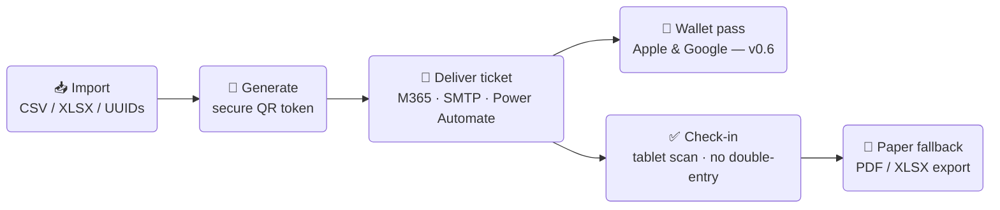

<p align="center">
  
</p>

<p align="center">
  <a href="https://github.com/solarssk/admitto/actions/workflows/ci.yml"></a>
  &nbsp;
  <a href="https://github.com/solarssk/admitto/releases"></a>
  &nbsp;
  
  &nbsp;
  
</p>

<p align="center">
  Self-hosted registration-to-check-in for internal corporate events.<br>
  One source of truth. No SaaS. No recurring fees.
</p>

---

> **Status: pre-MVP / early development — internal use only.**
> Not ready for production with real personal data until the data protection review is complete.
> See [DATA-PROTECTION.md](DATA-PROTECTION.md) and [SECURITY.md](SECURITY.md) before deploying.
>
> This repository contains only generic code and synthetic data (`@example.com`).
> No secrets, no real personal data are ever committed here.

## How it works



## Features

- 🎫 **Secure QR tickets** — unpredictable tokens, single-use, replay-safe
- 📧 **Flexible mail delivery** — M365 Graph, SMTP, or Power Automate; Outlook-safe HTML templates
- 📱 **Wallet passes** — Apple & Google Wallet via PassCreator *(v0.6)*
- ✅ **Operator-first check-in** — scanner-driven, tablet-ready, manual lookup, offline-safe
- 🔒 **Strong security defaults** — 2FA (TOTP), OIDC, Cloudflare Access, AES-256-GCM at-rest, audit logs
- 🏢 **Self-hosted, multi-org** — superadmin / admin / operator RBAC; one instance, multiple organisations

## Stack

| Layer | Technologies |
|-------|-------------|
| Runtime | Node.js 24, TypeScript, Docker |
| Backend | Hono 4, PostgreSQL (Prisma), Redis |
| Frontend | React 19, react-router 7, Vite, Tabler design tokens |
| Mail | M365 Graph · SMTP · Power Automate |
| Auth | Local accounts · OIDC (Authentik) · Cloudflare Access (ZTNA) · 2FA (TOTP) |

## Prerequisites

- Node.js `>=24.17.0 <25` (see root `package.json` `engines`)
- [Docker](https://docs.docker.com/get-docker/) — required to run PostgreSQL locally (and optional Redis)

## Quick start

Local **development** uses [`infra/docker-compose.yml`](infra/docker-compose.yml) (loopback Postgres/Redis).
**Production** uses a separate stack — see [deploy/README.md](deploy/README.md) and do not reuse dev credentials there.

```bash
# 1. Start Postgres (+ optional Redis for shared rate limits)
docker compose -f infra/docker-compose.yml up -d db redis

# 2. Configure database connection
cp packages/db/.env.example packages/db/.env
# Set ENCRYPTION_KEY before enrolling MFA or OIDC: openssl rand -base64 32

# 3. Install, migrate, seed, prepare test databases
npm install
npm run db:migrate
npm run db:seed
npm run db:test-setup

# 4. Run tests (coverage: npm run coverage — same tests + LCOV reports)
npm test

# 5. Bootstrap the first superadmin (password read from stdin — never pass on argv)
npm run auth:bootstrap -- --email admin@example.com
```

Then start the staff UI:

| Mode | Commands | URL |
|------|----------|-----|
| **SPA hot reload** (UI work) | `npm run dev -w @admitto/web` + `npm run dev -w @admitto/admin` | http://localhost:5173 |
| **Single server** (prod-like) | `npm run build -w @admitto/admin` then `npm run dev -w @admitto/web` | http://localhost:3000/login |

Sign in with the bootstrapped account. MFA enrolment is required on first login for admin and superadmin roles.

More detail: [infra/README.md](infra/README.md) · [apps/web/README.md](apps/web/README.md) · [apps/admin/README.md](apps/admin/README.md)

## Documentation map

| You are… | Start here |
|----------|------------|
| **Event Manager, check-in operator, or Superadmin** (using Admitto) | [User guide Wiki](https://github.com/solarssk/admitto/wiki) |
| **Developer** (local setup, tests) | This README · [infra/README.md](infra/README.md) · [AGENTS.md](AGENTS.md) |
| **Operator** (production deploy) | [deploy/README.md](deploy/README.md) |
| **Security / privacy reviewer** | [SECURITY.md](SECURITY.md) · [docs/security/SECURITY-CONTROLS.md](docs/security/SECURITY-CONTROLS.md) · [docs/ARCHITECTURE-FOR-AUDITORS.md](docs/ARCHITECTURE-FOR-AUDITORS.md) |
| **DPO / GDPR** | [DATA-PROTECTION.md](DATA-PROTECTION.md) · [docs/GDPR-ONE-PAGER.md](docs/GDPR-ONE-PAGER.md) · [docs/DSAR-PROCEDURE.md](docs/DSAR-PROCEDURE.md) |

## Production deployment

Self-hosted **Docker Compose** only. Images are published to `ghcr.io/solarssk/admitto` on each `vX.Y.Z` git tag.
See [deploy/README.md](deploy/README.md).

## Packages

| Package | Layer | Description |
|---------|-------|-------------|
| [`apps/web`](apps/web/README.md) | server | Hono HTTP server — routes, HTML, rate limits |
| [`apps/admin`](apps/admin/README.md) | frontend | Staff React SPA — events, check-in, admin tooling |
| [`apps/cli`](deploy/README.md#emergency-cli-event-day-failover) | ops | Emergency CLI (`checkin`, export, mail retry, auth recovery) — see deploy runbook |
| [`packages/ui`](packages/ui/package.json) | shared | Shared React components, tokens, toast stack |
| [`packages/auth`](packages/auth/README.md) | shared | Sessions, 2FA, OIDC, Cloudflare Access, RBAC |
| [`packages/crypto`](packages/crypto/README.md) | shared | AES-256-GCM at-rest encryption |
| [`packages/db`](packages/db/README.md) | shared | Prisma schema + PostgreSQL client |
| [`packages/import`](packages/import/README.md) | shared | CSV / XLSX attendee import |
| [`packages/mail-delivery`](packages/mail-delivery/README.md) | shared | Email orchestration + delivery tracking |
| [`packages/mail-templates`](packages/mail-templates/README.md) | shared | MJML/HTML email templates |
| [`packages/mailer`](packages/mailer/README.md) | shared | Mail transports (Graph, SMTP, Power Automate) |
| [`packages/mailer-config`](packages/mailer-config/README.md) | shared | Per-scope mail transport resolver |
| [`packages/shared`](packages/shared/README.md) | shared | Shared helpers |
| [`packages/tickets`](packages/tickets/README.md) | shared | Tokens, QR generation, check-in domain |

## Roadmap

| Milestone | What ships |
|-----------|------------|
| v0.5 | 🔌 External-ingest API (Power Automate / MS Forms), users-table UX |
| v0.6 | 📱 Apple & Google Wallet passes (PassCreator) |
| v0.7 | 📋 RSVP intake, calendar invites, waitlist |
| v0.8–0.9 | 🔧 Hardening, stress testing, dry run |
| **v1.0** | **🚀 First event go-live** |
| v1.1+ | 🌍 Self-service registration, multi-language, multi-track |

## Security & data

- Report vulnerabilities: [SECURITY.md](SECURITY.md)
- Data protection & GDPR: [DATA-PROTECTION.md](DATA-PROTECTION.md), [docs/](docs/)
- Never commit `.env` files, real attendee lists, or credentials
- **AI agents:** start from [AGENTS.md](AGENTS.md) (all tools) and [CLAUDE.md](CLAUDE.md) (Claude Code)

## Licence

MIT
