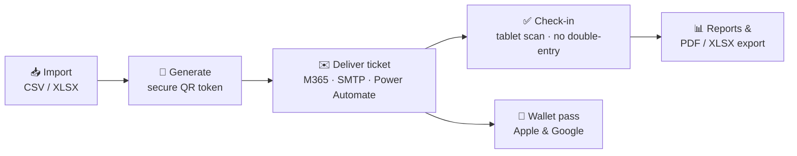

<p align="center">
  <picture>
    <source media="(prefers-color-scheme: dark)" srcset="docs/assets/admitto-logo-dark.svg">
    
  </picture>
</p>

<p align="center">
  <a href="https://github.com/solarssk/admitto/actions/workflows/ci.yml"></a>
  &nbsp;
  <a href="https://github.com/solarssk/admitto/releases"></a>
  &nbsp;
  
  &nbsp;
  
  &nbsp;
  <a href="LICENSE"></a>
</p>

<p align="center">
  <strong>Self-hosted registration-to-check-in for internal corporate events.</strong><br>
  One source of truth. No SaaS. No recurring fees.
</p>

---

> Treat personal data carefully until your organisation's data protection review is complete.
> See [DATA-PROTECTION.md](DATA-PROTECTION.md) and [SECURITY.md](SECURITY.md) before deploying.
>
> This repository contains only generic code and synthetic data (`@example.com`).
> No secrets and no real personal data are ever committed here.

## Documentation map

Admitto is **self-hosted software**, not a subscription service you sign up for. Someone
technical (an in-house developer or an IT contractor) needs to deploy and run it, using
[Production deployment](#production-deployment) below. If you don't have that today, that's the
first thing to plan for, before the rest of this README.

| You are… | Start here |
|----------|------------|
| **Deciding whether to adopt Admitto** (no in-house IT yet) | [docs/security/CORPORATE-DEPLOYMENT.md](docs/security/CORPORATE-DEPLOYMENT.md): what running it actually requires |
| **Event Manager, check-in operator, or Superadmin** (using Admitto) | [User guide Wiki](https://github.com/solarssk/admitto/wiki) (source: [`docs/wiki/`](docs/wiki/)) |
| **Developer** (local setup, tests) | This README · [infra/README.md](infra/README.md) · [packages/README.md](packages/README.md) · [AGENTS.md](AGENTS.md) · [CLAUDE.md](CLAUDE.md) |
| **Operator** (production deploy) | [deploy/README.md](deploy/README.md) · [deploy/ENV.md](deploy/ENV.md) (env dictionary) |
| **Security / privacy reviewer** | [SECURITY.md](SECURITY.md) · [docs/security/SECURITY-CONTROLS.md](docs/security/SECURITY-CONTROLS.md) · [docs/security/ARCHITECTURE-FOR-AUDITORS.md](docs/security/ARCHITECTURE-FOR-AUDITORS.md) |
| **DPO / GDPR** | [DATA-PROTECTION.md](DATA-PROTECTION.md) · [docs/security/GDPR-ONE-PAGER.md](docs/security/GDPR-ONE-PAGER.md) · [docs/security/DSAR-PROCEDURE.md](docs/security/DSAR-PROCEDURE.md) |

The rest of this README (features, stack, local setup) is written for the **Developer** row above.

## How it works



All of the above is supported today.

## Features

Unfamiliar term below (TOTP, OIDC, …)? Check the [Glossary](docs/wiki/Glossary.md).

| | Area | What it does |
|---|------|--------------|
| 🎫 | **Tickets** | Each guest gets a unique QR and a browser ticket page. Venue map, directions, and weather when you configure them. |
| 📱 | **Wallet passes** | Add to Apple Wallet / Google Wallet from the ticket page, backed by PassCreator. Staff can void, restore, push updates, or delete a pass, and see whether the attendee actually added it. |
| ✉️ | **Mail** | Send tickets via Microsoft 365, SMTP, or Power Automate. Detect bounced mail and inspect why a send failed. |
| 👥 | **Attendees** | Import from CSV/XLSX, ticket types, custom fields, bulk actions, and delete a guest when required (GDPR). |
| ✅ | **Check-in** | Scan with a camera or USB scanner, or look someone up by name. Hand out badges and items. Beep / vibration on each scan. |
| 🖥️ | **Staff admin** | Events, reports, and who can access what. Staff can connect or disconnect their own company SSO from My account. |
| ⚙️ | **Ops** | A background worker sends mail and finishes long imports/exports. Health page plus audit and security logs. |
| 🔒 | **Security** | Two-factor login (TOTP), company SSO (OIDC), optional Cloudflare Access. Secrets encrypted at rest. Session and login logs show the country for each IP, looked up on your own server (no external geo API). |
| 🏠 | **Hosting** | You run it yourself. Roles: Superadmin, Admin, Operator. |

**Coming later:** public self-service registration is not part of Admitto; first-event intake is planned via MS Forms → `/api/ingest`.

## Stack

| | Layer | Technologies |
|---|-------|-------------|
| 🟢 | **Runtime** | Node.js 24, TypeScript, Docker |
| 🔌 | **Backend** | Hono 4, PostgreSQL (Prisma 7), Redis |
| 🎨 | **Frontend** | React 19, react-router 7, Vite, Tabler design tokens |
| 📬 | **Mail** | M365 Graph · SMTP · Power Automate · IMAP bounce ingest |
| 🔑 | **Auth** | Local accounts · OIDC · Cloudflare Access (ZTNA) · 2FA (TOTP) |

## Prerequisites

- Node.js `>=24.17.0 <25` (see root `package.json` `engines`)
- [Docker](https://docs.docker.com/get-docker/) - required to run PostgreSQL locally (and optional Redis)

## Quick start

Local **development** uses [`infra/docker-compose.yml`](infra/docker-compose.yml) (loopback Postgres/Redis).
**Production** uses a separate stack - see [deploy/README.md](deploy/README.md) and do not reuse dev credentials there.

```bash
# 1. Start Postgres (+ optional Redis for shared rate limits)
docker compose -f infra/docker-compose.yml up -d db redis

# 2. Configure database connection
cp packages/db/.env.example packages/db/.env
# Set ENCRYPTION_KEY before enrolling MFA or OIDC: openssl rand -base64 32

# 3. Install, migrate, seed, prepare test databases
npm install
npm run db:migrate
npm run db:seed
npm run db:test-setup

# 4. Run tests (coverage: npm run coverage - same tests + LCOV reports)
npm test

# 5. Bootstrap the first superadmin (password read from stdin - never pass on argv)
npm run auth:bootstrap -- --email admin@example.com
```

Then start the staff UI:

| Mode | Commands | URL |
|------|----------|-----|
| **SPA hot reload** (UI work) | `npm run dev -w @admitto/web` + `npm run dev -w @admitto/admin` | http://localhost:5173 |
| **Single server** (prod-like) | `npm run build -w @admitto/admin` then `npm run dev -w @admitto/web` | http://localhost:3000/login |

Sign in with the bootstrapped account. MFA enrolment is required on first login for admin and superadmin roles.

For bulk mail, import commit, bounce detection, and retention in local dev, also run:

```bash
npm run worker
```

More detail: [infra/README.md](infra/README.md) · [apps/web/README.md](apps/web/README.md) · [apps/admin/README.md](apps/admin/README.md) · [deploy/README.md](deploy/README.md)

## Production deployment

Self-hosted **Docker Compose** only. Images are published to `ghcr.io/solarssk/admitto` on each `vX.Y.Z` git tag.
Compose runs **`app`**, **`migrate`**, and a single **`worker`** (mail drain, import/export, bounce, retention).
See [deploy/README.md](deploy/README.md).

## Repo layout

| Path | Role |
|------|------|
| [`apps/web`](apps/web/README.md) | HTTP API, auth HTML, ticket page, rate limits |
| [`apps/admin`](apps/admin/README.md) | Staff React SPA (events, check-in, settings) |
| [`apps/cli`](apps/cli/README.md) | `admitto` CLI (worker, auth recovery, event-day failover) |
| [`packages/`](packages/README.md) | Shared libraries (auth, tickets, mail, db, ui, …) |
| [`infra/`](infra/README.md) | Local Docker Compose (Postgres / Redis) |
| [`deploy/`](deploy/README.md) | Production Compose, image, env |
| [`docs/wiki/`](docs/wiki/) | Operator Wiki source |

## Roadmap

Canonical roadmap: [VERSIONING.md](VERSIONING.md). Short view:

| Milestone | What ships |
|-----------|------------|
| **v0.4.x** ✅ | Current line (import → ticket mail → check-in → reports; location, bounce, Health, worker, …) |
| **v0.5** | External-ingest `/api/ingest` (MS Forms / Power Automate), users UX, wallet passes (PassCreator) |
| **v0.6** | TBD |
| **v0.7** | RSVP intake, calendar invites, waitlist |
| **v0.8-0.9** | Hardening, stress testing, dry run |
| **v1.0** | First event go-live |
| **v1.1+** | Self-service registration, multi-language, multi-track |

## Licence

[Apache License 2.0](LICENSE): a permissive open-source licence. You can self-host, modify, and
run Admitto internally at no cost; keep the copyright and NOTICE file with any distribution.
This is not legal advice, review the licence text for your own compliance needs.
Copyright and Apache NOTICE: [NOTICE](NOTICE). Third-party attribution (OFL fonts, LGPL libvips): [THIRD-PARTY-NOTICES.md](THIRD-PARTY-NOTICES.md).
