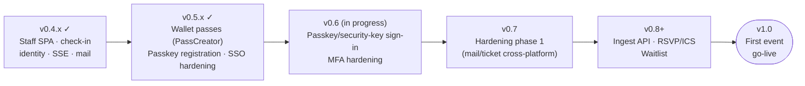

# Versioning

> **Stability status:** see the table below for what `v0.x`, `v1.0`, and `v1.1+` mean, and check
> the current release tag or the open GitHub milestone for exactly where the project is right
> now. That status lives there, not restated here, so it can't go stale between releases.

Admitto uses **one product version** for releases. Internal workspace packages are not versioned independently.

## Source of truth (product)

| What | Where |
|------|--------|
| **Release number** | Git tag `v0.x.y` on `main` |
| **Human-readable history** | [`CHANGELOG.md`](CHANGELOG.md) |
| **Tracked in repo** | Root [`package.json`](package.json) `"version"` — bumped when cutting a release |

GitHub **milestones** (`v0.3.6`, `v0.4.0`, …) group PRs toward the next tag; milestone title matches the upcoming product version.

## Product version lines (what `v0.x` vs `v1.0` means)

Admitto ships as **one product** with git tags like `v0.4.0`. That is **not** independent semver for each npm workspace package — it is the **release train** toward the first real event.

| Line | Meaning |
|------|---------|
| **`v0.x`** | **Path to MVP.** Everything required for the **first event** is built across `v0.4` → `v0.9`. Pre-1.0 tags are expected to iterate and refactor. Tags before `v0.4.13` are marked **pre-release** on GitHub; from `v0.4.13` onward, releases are stable enough for day-to-day use and are marked as the **latest** GitHub Release, even though the product isn't yet operator-ready for a real event. |
| **`v1.0`** | **First-event go-live gate.** MVP is complete and event-ready. After this tag, the product can run a real event end-to-end. |
| **`v1.1+`** | **Post-first-event feature waves.** Capabilities that are useful but **not** required for the first go-live (see examples below). |

### Planned sequence (high level)

This is the current product roadmap — details live in milestone descriptions and `CHANGELOG.md`:



| Version | Focus |
|---------|--------|
| **v0.4** | Operator UI + event-day ops + staff SPA foundation (through current `v0.4.x` patches — see [CHANGELOG.md](CHANGELOG.md)). |
| **v0.5** | Delivered - wallet passes (Apple/Google via PassCreator), passkey/security-key registration, SSO/OIDC hardening, users-table UX. |
| **v0.6** | In progress, not yet tagged - passkeys/security keys usable for sign-in and step-up (not just registration), first-time 2FA method choice, session-cookie and step-up security hardening. |
| **v0.7** | Hardening phase 1 (Outlook/iPhone/Android mail and ticket tests, operational fixes toward go-live). |
| **v0.8–v0.9** | External-ingest `/api/ingest`, RSVP intake, calendar iMIP/ICS, waitlist, template lifecycle triggers, further hardening + dry run (backup/restore, event-day readiness — ADR 0012) - not yet scheduled to a specific version. |
| **v1.0** | First event **go-live ready** = MVP complete. |
| **v1.1+** | New waves **after** the first event — e.g. native bounded registration form, branded domain (CNAME), i18n, multi-room, mini-CRM. |

### Common scope mistakes (read before opening a milestone PR)

- **First-event attendee intake** is planned as **MS Forms → Power Automate → `/api/ingest`**, not a native public registration UI inside Admitto - not yet built as of v0.6.0, and not yet assigned to a specific upcoming version.
- **Native registration form**, custom branded domain, full i18n, multi-room scheduling, and mini-CRM belong to **`v1.1+`**, not to `v0.5`–`v0.7` pre-go-live milestones.
- **`v0.x` patches** (`v0.4.1`, `v0.4.2`, …) are normal — they still belong to the same minor line until the next tagged minor (e.g. `v0.5.0`).

Internal Polish product guide (maintainer docs, outside this public repo) mirrors this model; **this file is the canonical English definition for contributors and operators.**

## Workspace packages (`0.0.1`)

Every `packages/*` and `apps/web` `package.json` keeps `"version": "0.0.1"`. That is intentional:

- packages are `private: true` and linked with `"@admitto/foo": "*"`
- they are not published to npm
- only the **monorepo product version** matters for operators and release notes

Do not bump per-package versions unless we start publishing libraries separately.

## Cutting a release

1. Move `CHANGELOG.md` entries from `[Unreleased]` to a new `## [0.x.y] - YYYY-MM-DD` section following [Keep a Changelog](https://keepachangelog.com/en/1.1.0/) format
2. Update the `[Unreleased]` comparison link at the bottom of `CHANGELOG.md` to point to the new tag
3. Add the new comparison link for the release (e.g. `[0.x.y]: https://github.com/solarssk/admitto/compare/v0.x.z...v0.x.y`)
4. Set root `package.json` `"version"` to `0.x.y` (no `v` prefix)
5. Generate release artifacts and sync doc markers before opening the release PR:
   ```bash
   python3 scripts/generate-release-notes.py 0.x.y "short tagline for GitHub Release title"
   python3 scripts/sync-release-docs.py
   npm install --package-lock-only
   ```
   `generate-release-notes.py` writes `.github/release-notes/v0.x.y.md` and `.github/release-notes/v0.x.y.title` (tagline only — workflow composes `v0.x.y — tagline`, same pattern as earlier releases). `sync-release-docs.py` updates `<!-- admitto:latest-patch -->` markers (e.g. in `SECURITY.md`) from `package.json`. CI runs `python3 scripts/sync-release-docs.py --check` on every PR.
   Release notes follow the same [Keep a Changelog](https://keepachangelog.com/en/1.1.0/) typed sections as `CHANGELOG.md` for that version, plus a short **Deploy** footer (container image, migration policy). Do not use the deprecated v0.3.x emoji template. See [`.github/release-notes/v0.4.4.md`](.github/release-notes/v0.4.4.md) as reference.
6. Commit on `main` — include `CHANGELOG.md`, `package.json`, `package-lock.json`, synced docs, `.github/release-notes/v0.x.y.md`, and `.github/release-notes/v0.x.y.title` in one release commit (subject exactly `release: v0.x.y`).
7. **Merge the release PR** — GitHub Actions [`.github/workflows/release.yml`](.github/workflows/release.yml) on `main` then:
   - verifies release artifacts (`sync-release-docs.py --check`, notes file, non-empty `.title` file, CHANGELOG section),
   - creates git tag `v0.x.y` and GitHub Release from `.github/release-notes/v0.x.y.md` with title `v0.x.y — …` from the `.title` file, marked as the **latest** release,
   - triggers [`publish-container.yml`](.github/workflows/publish-container.yml) (GHCR image, SBOM upload),
   - closes the open milestone titled `v0.x.y`.

   Local [`scripts/release-tag.sh`](scripts/release-tag.sh) remains for emergency **GPG/SSH-signed** tags only (see below) — not the default path.

### Tag signing (optional — emergency manual releases)

CI-created tags from `release.yml` are ordinary GitHub tags (not GPG/SSH-signed). For a **Verified** signed tag, delete the CI tag and use `release-tag.sh` instead — rare.

**SSH signing** (if commits already use `gpg.format ssh`):

```bash
git config gpg.format ssh
git config user.signingkey ~/.ssh/id_ed25519.pub   # path to your *public* key
```

Upload that public key on GitHub → **Settings → SSH and GPG keys → New SSH key → Signing Key**.

**GPG** alternative: `git config gpg.format openpgp`, set `user.signingkey` to your key id, upload the public GPG key to GitHub.

Smoke test (optional):

```bash
git tag -s v0.0.0-signing-smoke -m test HEAD~1
git cat-file tag v0.0.0-signing-smoke | grep -E -q 'BEGIN (SSH|PGP) SIGNATURE'
git tag -d v0.0.0-signing-smoke
```

**Container image:** pushing git tag `v0.x.y` publishes `ghcr.io/solarssk/admitto:0.x.y` and the rolling minor tag `ghcr.io/solarssk/admitto:0.x` (see `deploy/README.md`).

Runtime (`/healthz`, Docker labels) does not expose version yet — by design until we need operator-facing build info.
