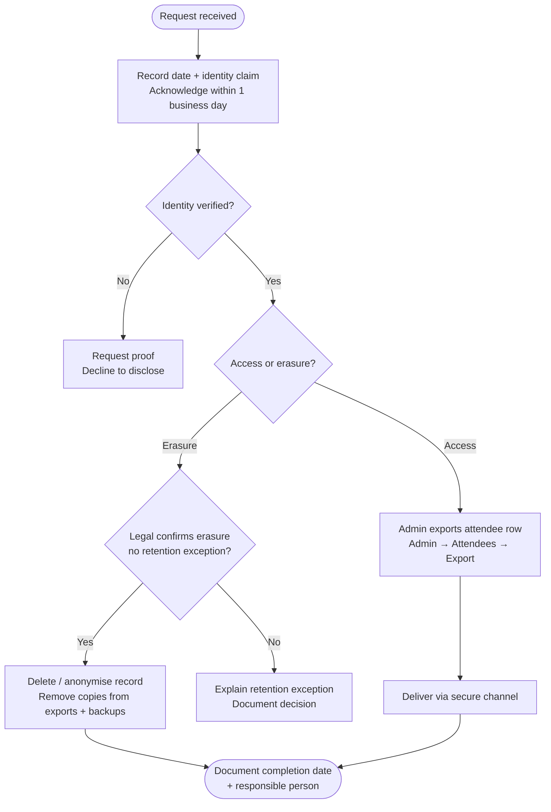

# Data Subject Access and Erasure — Organizer-Mediated Procedure (Option B)

Template for deployments that **do not** use self-service DSAR APIs. Adapt to your organisation's
privacy policy and legal sign-off. **Not legal advice.**

See also: [GDPR-ONE-PAGER.md](GDPR-ONE-PAGER.md) (Option B).

---

## Process overview



---

## 1. Intake

- Request arrives (email, helpdesk, in person) → record **date received**, requester identity, event.
- Privacy officer or designated organizer acknowledges receipt within **one business day**.

## 2. Verify identity

- Match requester to an attendee record (email, ticket reference, or ID checked by organizer).
- If identity cannot be verified, do not disclose data; explain what proof is required.

## 3. Access (export)

- Organizer with `admin` role exports the attendee row via **Admin → Attendees → Export**
  (CSV/XLSX/PDF, filtered to the data subject if needed).
- Deliver export through your organisation's **secure channel** (encrypted mail, ticket system).
- Log: who exported, when, which event — use your internal audit process.

## 4. Erasure

- After legal confirms erasure is required and no retention exception applies:
  1. Delete or anonymise the attendee record in Admitto (manual DB operation or admin workflow
     when available).
  2. Remove copies from local exports, mail logs, and backup retention per your backup policy.
- Document completion date and responsible person.

### Manual DB erasure order

Until Admitto ships an attendee erasure endpoint, operators handling erasure by direct database
operation must remove dependent rows before deleting the attendee. In particular,
`EmailDelivery`, `WalletPass`, and `CheckIn` reference attendees with `ON DELETE RESTRICT`.
Sent delivery rows can include rendered ticket email HTML.

Run the operation in one transaction and scope it to the event and attendee:

```sql
BEGIN;

-- Replace values before execution.
\set event_id 'evt_...'
\set attendee_id 'att_...'

DELETE FROM "EmailDelivery"
WHERE "event_id" = :'event_id'
  AND "attendee_id" = :'attendee_id';

DELETE FROM "WalletPass"
WHERE "attendee_id" = :'attendee_id';

DELETE FROM "CheckIn"
WHERE "event_id" = :'event_id'
  AND "attendee_id" = :'attendee_id';

DELETE FROM "Attendee"
WHERE "event_id" = :'event_id'
  AND "id" = :'attendee_id';

COMMIT;
```

If the final `DELETE FROM "Attendee"` affects zero rows, roll back and re-check the event/attendee
ids before recording completion.

## 5. SLA (customer-defined)

| Step | Suggested target |
|------|------------------|
| Acknowledge request | 1 business day |
| Fulfill access / erasure | Per applicable law (e.g. **one month** under GDPR Art. 12(3); shorten internally if policy requires) |

---

## Related documents

- [GDPR-ONE-PAGER.md](GDPR-ONE-PAGER.md)
- [DATA-PROTECTION.md](../DATA-PROTECTION.md)
- [INCIDENT-RESPONSE.md](INCIDENT-RESPONSE.md)
