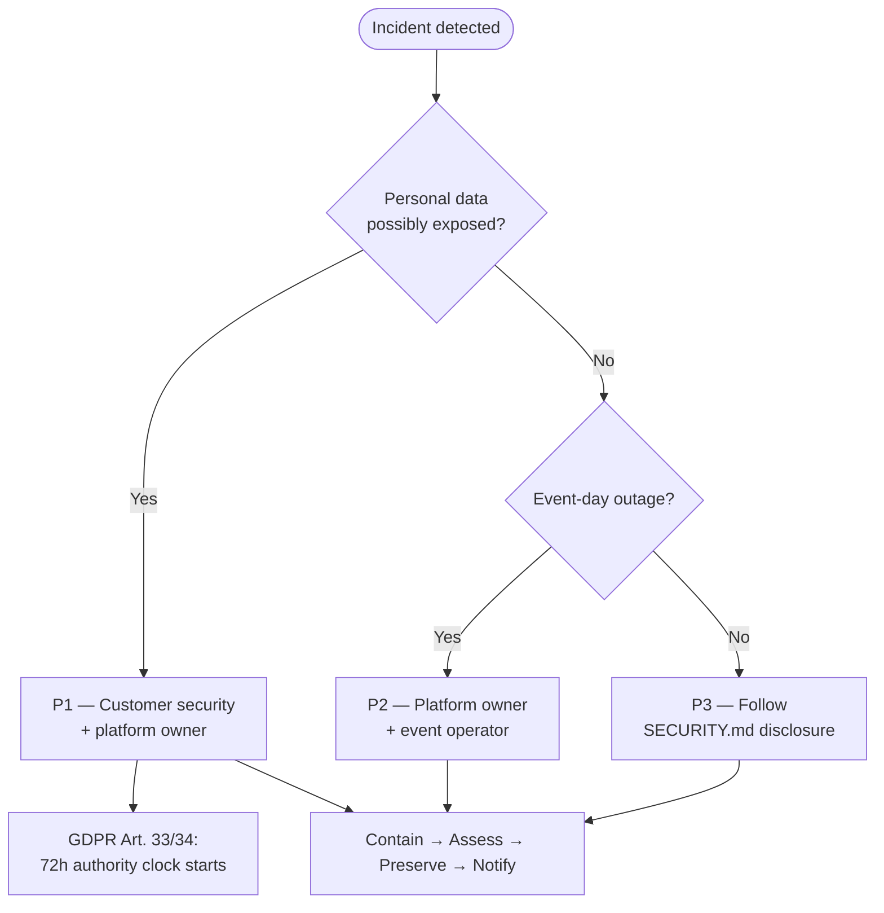

# Incident Response (One-Pager)

Template for security and availability incidents in a **self-hosted** Admitto deployment.
Assign names and contacts in your internal runbook.

---

## Triage



## Severity

| Level | Examples | Lead |
|-------|----------|------|
| **P1** | Suspected data breach, leaked production secrets | Customer security + platform owner |
| **P2** | Outage on event day, mail or database unavailable | Platform owner + event operator |
| **P3** | Vulnerability in Admitto or dependencies | Follow [SECURITY.md](../SECURITY.md) disclosure |

---

## First 30 minutes

1. **Contain** — rotate exposed secrets; disable compromised accounts; block abusive traffic at edge.
2. **Assess** — admin audit log, **Security audit log** (Settings → Logs & audit → Security audit
   log, superadmin only — durable login/MFA/logout/OIDC/access-denied history; survives a restart,
   so prefer it over the live tail below for reconstructing what happened — but writes are
   best-effort, so a DB hiccup at the moment of the event can leave a gap even though the
   underlying auth action itself succeeded, and rows past the retention window, 30 days by
   default, are gone), **System logs** live tail (Settings → Logs & audit → System, superadmin
   only — shows recent activity in near real time, but only the last 1000 entries and only while
   the server process is still running), readiness probe, mail delivery log, recent deployments.
3. **Preserve** — snapshot logs and database if investigation is likely.
4. **Notify** — privacy officer if personal data may be affected. Under **GDPR Art. 33** (when
   applicable), notify the supervisory authority **without undue delay and, where feasible, within
   72 hours** of becoming aware of a personal-data breach — unless the breach is unlikely to result
   in a risk to individuals. Notify affected data subjects when required (**Art. 34**). Record
   timeline, scope, and decision in your internal breach register.

---

## Secret rotation

Treat any secret exposed in logs, tickets, or version control as **compromised**:

| Secret type | Action |
|-------------|--------|
| Database password | Rotate in database and deployment config; restart services |
| Mail integration | Rotate in M365 / SMTP provider and application settings |
| Encryption key | Major incident — plan re-encryption with maintenance window |
| Monitoring token | Regenerate and update observability tools |
| Session compromise | Invalidate active sessions; force staff re-authentication |

See [SECURITY.md](../SECURITY.md) for the project secret policy.

---

## Rollback

| Situation | Action |
|-----------|--------|
| Bad application release, schema unchanged | Deploy previous container image tag |
| Failed database migration | Restore pre-migration backup; redeploy previous image |

Procedure detail: `deploy/README.md` (rollback runbook).

---

## Health checks

```bash
curl -fsS https://<your-host>/healthz
curl -fsS -H "Authorization: Bearer <readiness-token>" https://<your-host>/readyz
```

Readiness output is intended for operators — no personal data in responses.

---

## Aftercare

1. Root cause and timeline.
2. Update runbook or perimeter controls if needed.
3. Privacy / DPO sign-off when personal data was involved (include 72h authority notification decision if GDPR applies).
4. Patch dependencies or deploy hotfix release if applicable.

---

## Related documents

- [SECURITY.md](../SECURITY.md)
- [SECURITY-CONTROLS.md](security/SECURITY-CONTROLS.md)
- [DATA-PROTECTION.md](../DATA-PROTECTION.md)
- [CORPORATE-DEPLOYMENT.md](CORPORATE-DEPLOYMENT.md)
