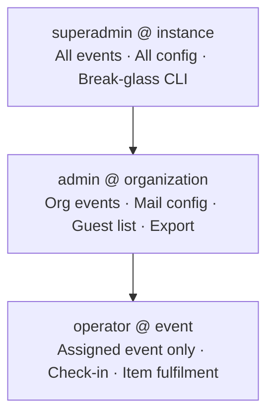

# Security Controls (Application)

This document describes **security capabilities** that Admitto supports in typical
self-hosted deployments. It is written for **privacy officers, security reviewers, and operators**
at mid-size and enterprise organizations.

For **repository CI** (SAST, secret scan, container scan, SBOM), see [SECURITY.md](../SECURITY.md).
For **hosting and data residency**, see [CORPORATE-DEPLOYMENT.md](CORPORATE-DEPLOYMENT.md).

> **How to read this:** rows describe what organizations commonly require and how Admitto can be
> configured — not a checklist of what any single deployment must enable. Your runbook and
> environment variables define the effective control set.
>
> **`Where` column:** **App** = built into the application; **Config** = available but must be
> enabled or tuned in deployment settings; **Operator** = customer infrastructure or process
> (reverse proxy, disk encryption, perimeter, runbooks).

---

## Control areas (summary)

| Area | Typical enterprise expectation | Admitto support | Where |
|------|-------------------------------|-----------------|-------|
| Authentication | Staff sign-in before admin/operator actions | Local accounts and/or **OIDC** | App · Config |
| Authorization | Least privilege by role and event/org scope | **RBAC** (admin, operator, platform roles) | App |
| Strong auth | MFA for privileged users | **TOTP** for elevated roles | App · Config |
| Edge access | Restrict staff URLs at the perimeter | Optional zero-trust / access gateway in front of staff paths | Operator |
| Session security | HttpOnly cookies, TLS, rotation | Configurable lifetime; server-side revocation | App · Config |
| CSRF | Protect state-changing browser requests | Same-origin checks on mutating requests (behind standard reverse proxy) | App |
| Abuse prevention | Rate limits on auth, public, ops, and admin surfaces | Per-route throttling (see **Rate limiting** below; shared Redis store recommended in production) | App · Config |
| Outbound fetch safety | Block SSRF from OIDC / JWKS admin actions | Hostname blocklist + DNS resolve-before-connect on outbound HTTP | App |
| Secrets | No credentials in source code | Env / secret manager; integration secrets encrypted in DB | App · Operator |
| Data at rest | Protect tickets and integration secrets | Field-level encryption for sensitive data; **disk encryption** | App · Operator |
| Transport | TLS to users | Terminated at customer **reverse proxy, load balancer, or CDN** | Operator |
| Logging | Minimise personal data in logs | Redacted identifiers in audit output; no secrets in log lines | App |
| Supply chain | Scans on code and container image | Documented in [SECURITY.md](../SECURITY.md) | App |

---

## Authentication and access

### Role hierarchy

**Staff surfaces** (administration, check-in) require authentication. Deployments may use:

- **Local accounts** with password and optional MFA for privileged roles.
- **OIDC / SSO** (optional) alongside a local break-glass administrator account.
- **Perimeter access control** (optional) — e.g. corporate zero-trust gateway, VPN, or CDN access
  rules in front of staff URLs. This complements, but does not replace, application RBAC.

Sessions are **server-side** (opaque token, hash stored in the database). Cookie flags follow
common web hardening (`httpOnly`, `SameSite`, `secure` in production).

### Implemented in codebase (v0.4.3)

These capabilities exist in the application — they are **not** roadmap-only claims:

| Capability | Where |
|------------|-------|
| TOTP MFA (privileged roles) | `packages/auth` — MFA enrollment and verification |
| OIDC / SSO | `packages/auth` OIDC provider module; staff login routes in the web app |
| Local break-glass admin | Local account provider alongside OIDC |

Effective controls still depend on **customer configuration** (OIDC disabled by default; TOTP
required only when policy flags are set). Confirm your deployment runbook matches your security
policy.

---

## Authorization (RBAC)

Roles are scoped to **instance**, **organization**, or **event** as appropriate:

| Role | Typical use |
|------|-------------|
| Platform administrator | System configuration, integrations, user management |
| Event organizer | Import, mail, exports, event configuration |
| Check-in operator | Event-day scanning and lookup only |

Access checks are enforced on API routes and staff UI entry points.

---

## Optional hardening (customer choice)

Organizations with stricter policies often add controls **outside** the application:

| Layer | Examples (customer infrastructure) |
|-------|-------------------------------------|
| Edge / CDN | Cloudflare, Akamai, corporate CDN with WAF |
| Reverse proxy | nginx, **Nginx Proxy Manager**, HAProxy, F5, cloud load balancer |
| Network | Site-to-site VPN, zero-trust client, private link to origin |
| Identity | Entra ID, Okta, Authentik, other OIDC providers |
| Mail | Microsoft 365 / Graph, corporate SMTP relay |

Admitto is designed to sit **behind** a trusted reverse proxy (`TRUST_PROXY` and forwarded headers
documented in [`deploy/README.md`](../deploy/README.md)). The proxy must **overwrite**
`X-Forwarded-For` with the real client IP — never append to a browser-supplied value.

---

## Rate limiting

Application throttles use a sliding window (default **60 seconds** unless noted). Limits apply per
bucket key; HTTP **429** when exceeded. Structured audit events: `auth.rate_limit.exceeded` (see
`packages/auth` audit helpers).

**Store:** in-memory per process when `REDIS_URL` is unset; **Redis recommended in production** so
limits are shared across replicas and survive restarts.

### Public and authentication

| Surface | Bucket | Limit / window | Auth required |
|---------|--------|----------------|---------------|
| `POST /login`, `POST /api/auth/login` | client IP | 10 / 60 s | no |
| same | normalized email | 10 / 60 s | no (defense-in-depth inside handler) |
| `POST /api/auth/mfa/verify`, `POST /mfa/verify`, TOTP confirm | session + IP | 10 TOTP or 30 recovery / 15 min | partial session |
| `POST /api/auth/mfa/totp/enroll`, `POST /mfa/enroll/start` | session + IP | 10 / 15 min | partial session (`enrollment_required`) |
| `GET /api/auth/oidc/*/start`, `*/callback` | client IP | 20 / 60 s | no |
| `/t/*`, `/q/*` | client IP | 60 / 60 s | no |

### Operations probes

| Surface | Bucket | Limit / window | Auth |
|---------|--------|----------------|------|
| `GET /healthz` | client IP | 120 / 60 s | none (liveness; runs `SELECT 1`) |
| `GET /readyz` | client IP | 10 / 60 s | `OPS_HEALTH_TOKEN` (disabled when unset) |

Docker `HEALTHCHECK` uses `/healthz` only. External monitors should not poll `/healthz` faster than
a few requests per minute per source IP, or they may hit 429.

### Staff admin (authenticated)

| Surface | Bucket | Limit / window | Role |
|---------|--------|----------------|------|
| `POST …/import/preview` | user + event | 10 / 60 s | event admin |
| `POST …/import/commit` | user + event | 5 / 60 s | event admin |
| `POST …/template/preview` | user + event | 20 / 60 s | event admin |
| `POST …/template/test-send` | user + event | 5 / 60 s | event admin |
| `POST /api/admin/mail-settings/test` | user | 5 / 60 s | admin |
| attendee resend, check-in scan/history | per-route keys | see `apps/web/src/*-rate-limit.ts` | operator / admin |

### Superadmin (identity provider UI)

| Surface | Bucket | Limit / window |
|---------|--------|----------------|
| `POST /admin/auth/providers/:id/discover` | user + provider | 10 / 60 s |
| `POST /admin/auth/providers/:id/test` | user + provider | 10 / 60 s |

**Body size caps** (separate from rate limits): import uploads ≤ 5 MB; template JSON sized for
≤ 200k character body field — see `apps/web/src/admin/import-api-routes.ts` and
`communication-api-routes.ts`.

---

## Reverse proxy and client IP (`TRUST_PROXY`)

When `TRUST_PROXY=true` (default in [`deploy/.env.example`](../deploy/.env.example)):

| Header | Used for |
|--------|----------|
| `X-Forwarded-For` (first hop) | Rate limits, audit IP, login throttling |
| `X-Forwarded-Proto`, `X-Forwarded-Host` | CSRF origin check on mutating POSTs |

Implementation: [`apps/web/src/rate-limit/client-ip.ts`](../apps/web/src/rate-limit/client-ip.ts),
[`apps/web/src/auth/same-origin-post.ts`](../apps/web/src/auth/same-origin-post.ts).

**Operator requirement:** the edge proxy must set a **single** trusted client IP (e.g. nginx
`proxy_set_header X-Forwarded-For $remote_addr`). If the proxy **appends** to a client-sent
`X-Forwarded-For` chain, an attacker can pick the rate-limit bucket. This is a **deployment**
misconfiguration risk, not bypassable from the app alone.

**Hardening (v0.4.5+):** malformed or non-IP first hops fall back to the TCP remote address instead
of a shared `"unknown"` bucket (which previously allowed cross-client rate-limit interference).

When `TRUST_PROXY` is unset/false, forwarded headers are ignored for IP and CSRF origin (direct
socket / request URL used).

---

## Outbound HTTP (SSRF mitigation)

Superadmin OIDC provider **Discover** / **Test connection** and runtime OIDC token/JWKS fetches use
[`assertSafeOidcFetchUrl`](../packages/auth/src/oidc/safe-url.ts):

- HTTPS required in production (HTTP loopback allowed in development for mock IdPs).
- Literal private, link-local, and metadata hostnames rejected.
- **DNS resolve-before-connect** (`assertSafeOidcFetchUrlResolved`): hostname must not resolve to
  private/link-local addresses at request time (mitigates DNS rebinding).

Requires **superadmin** session (or Cloudflare Access JWT with instance admin role) for admin UI
discover/test. Residual risk: compromised superadmin account can still trigger outbound fetches to
**public** URLs the instance can reach — perimeter egress filtering remains an operator control.

---

## Data protection in operations

- **Ticket / QR payload:** opaque random identifier — no attendee name or email embedded in the QR.
- **Integration credentials** (mail, OIDC): stored encrypted in the application database; key
  supplied at deploy time via environment variable.
- **Logs:** intended for operations, not analytics — avoid logging full email addresses or secrets.
- **Health endpoints:** `/healthz` — liveness + DB ping, rate-limited, no PII; `/readyz` —
  token-gated detailed readiness (disabled when `OPS_HEALTH_TOKEN` unset). Both return baseline
  security headers; neither exposes secrets or attendee data.

---

## Known scope limits (MVP)

Be explicit with auditors about what is **out of product scope** today:

- No built-in SIEM or central log platform (forward container logs if required).
- No HA / multi-region failover in the default compose topology.
- No automated long-term PII purge job yet (retention **policy** documented; job planned for v1.0).
- Disk/volume encryption for PostgreSQL and Redis is an **infrastructure** control.
- No automated entropy check on `CHECKIN_OPERATOR_TOKEN` / `OPS_HEALTH_TOKEN` at boot — minimum
  length only; operators should generate with `openssl rand -hex 32` (documented in `.env.example`).
- Rate limits are application-layer; high-volume DoS may still require edge WAF/CDN or network
  controls in front of the origin.

### Penetration test verification (operator checklist)

Useful when repeating internal or vendor PEN tests against a staging instance:

1. **Proxy trust:** confirm NPM/nginx uses `$remote_addr` for `X-Forwarded-For`, not
   `$proxy_add_x_forwarded_for`, when `TRUST_PROXY=true`.
2. **Rate limits:** unauthenticated login → 429 on 11th attempt/minute; `/healthz` → 429 after
   sustained flood; MFA enroll requires partial session and throttles repeated secret fetches.
3. **CSRF:** cross-origin `POST /api/auth/login` without matching `Origin` → 403.
4. **AuthZ:** `GET /api/admin/events` without session → 401.
5. **SSRF:** OIDC discover to private IP literal blocked; hostname resolving to RFC1918 blocked
   after DNS check (superadmin action).
6. **Residual:** misconfigured proxy append on `X-Forwarded-For` can still spoof rate-limit IP —
   verify deploy runbook, not app-only config.

Source constants: `apps/web/src/**/*-rate-limit*.ts`, `packages/auth/src/oidc/safe-url.ts`.

---

## Related documents

- [SECURITY.md](../SECURITY.md) — vulnerability reporting, CI controls
- [DATA-PROTECTION.md](../DATA-PROTECTION.md) — personal data handling
- [CORPORATE-DEPLOYMENT.md](CORPORATE-DEPLOYMENT.md) — deployment model
- [ARCHITECTURE-FOR-AUDITORS.md](ARCHITECTURE-FOR-AUDITORS.md) — scope and data flows
- [GDPR-ONE-PAGER.md](GDPR-ONE-PAGER.md) — privacy summary for DPO review
