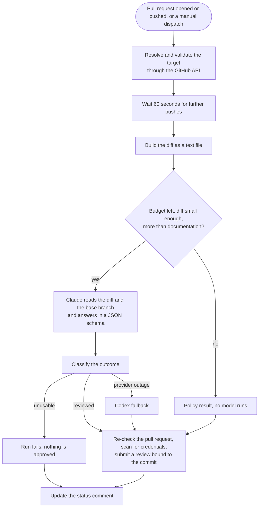

# How the AI review works

A short tour for contributors, and for anyone who wants to build a similar tool. To run it day
to day (commands, credentials, what to do when it fails) see [ai-review.md](ai-review.md). For
the general advice see [ai-review-lessons.md](ai-review-lessons.md).

## What it is

A GitHub Actions workflow that gives the repository owner's pull requests a second reviewer.
Claude reads the change and answers in a fixed JSON shape: a verdict (`approve` or `comment`), a
short summary and a list of blocking findings. A script turns the answer into a GitHub review
bound to the reviewed commit, and one status comment on the pull request says what happened.
It never merges, never pushes and never runs the pull request's code. The maintainer merges.

## The flow

## The parts

| Part | Where | What it does |
|---|---|---|
| Pipeline | `.github/workflows/ai-review.yml` | The flow above, one small step per job. |
| Prompt and schema | `.github/ai-review/prompt-live.md`, `schema-live.json` | What the reviewer is told and the shape it must answer in. Read from the base branch, never from the pull request. |
| Diff builder | `.github/ai-review/build-diff.jq` | Turns GitHub's per-file API output into the text the reviewer reads, and marks what it could not show. |
| Budget counter | `.github/ai-review/count-attempts.jq` | Counts the attempts that may have cost model tokens. |
| Outcome | `scripts/ai-review-outcome.mjs` | Tells a valid review from a provider outage and from a failure of our own CI. |
| Fallback | `scripts/ai-review-codex.mjs` | Asks the Codex connector for a review when Claude is down, and checks what comes back. |
| Status comment | `scripts/ai-review-status.mjs` | Builds the comment from the run's facts and from the execution log. |
| Commands | `.github/workflows/ai-review-command.yml`, `scripts/ai-review-command.mjs` | The owner's `/ai-review` comments. |
| Backtest | `.github/workflows/ai-review-backtest.yml` | Replays past pull requests with known defects to measure a prompt change. Posts nothing. |
| Tests | `scripts/ai-review-*.test.mjs` | Run the scripts, and the submit step's real bash with `gh` stubbed. |

## What is trusted

- The workflow definition comes from the base branch (`pull_request_target`), so a pull request
  cannot change the rules that review it. Nothing from it is checked out: the reviewer sees a
  text diff and the base branch.
- The diff, the description and the file names are untrusted. The prompt says so, the session is
  limited to the read-only tools Read, Grep and Glob (`--tools`; `--allowedTools` alone would only
  pre-approve them and leave a subagent, a shell and file writes on offer) and the answer is a
  fixed schema, so injected text has no tool to act with beyond reading files.
- Reading is not confined to the checkout, and what the model reads can end up in its answer. So
  the answer is untrusted as well: it is capped and scanned for credential-shaped text before it
  is posted (a safety net, not a proof), and the status comment carries no model text at all.
- Who may command it is decided by the commenter's immutable user id, never by a login.
- A model review approves only on a valid `approve` with no blocking finding. The other
  approvals say what they rest on: a path rule for documentation-only changes, a policy approval
  that states no review ran, a clean Codex result. Anything else is a comment or a failed run.

## How the status comment knows what the reviewer saw

The Coverage and Tools rows are not the model's words. After the run, `ai-review-status.mjs`
reads the action's execution log, which holds every message of the session, and keeps the books
itself:

1. A tool call is a `tool_use` block and its answer a `tool_result` block with the same id.
2. For a `Read` of the diff, the lines returned come from the tool's own structured result
   (`startLine`, `numLines`), so a big file cut to its first page counts as that page. The line
   numbers in the text are the fallback.
3. A content `Grep` of the diff counts the lines it printed.
4. Tools beyond Read, Grep and Glob, anything that ran inside a subagent and any result with no
   call behind it are counted, but what they showed cannot be measured. The figure then says
   "at least".
5. When no tool result can be matched to a call the row says "not available", not zero.

An approval that rests on a partly seen diff carries a warning. So does a session that was
offered more than the three tools: the first event of the log lists them, which shows on every run
whether the restriction took effect. The job log of the submit step also prints the shape of the
execution log (event kinds, tool names, counts, never content), so a change in what the action
writes shows up there before it misleads anyone.
