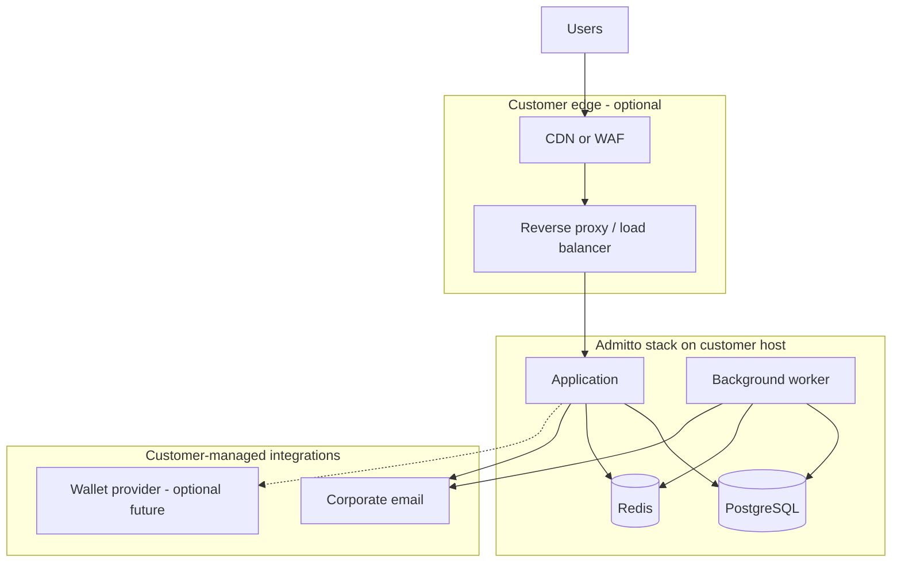
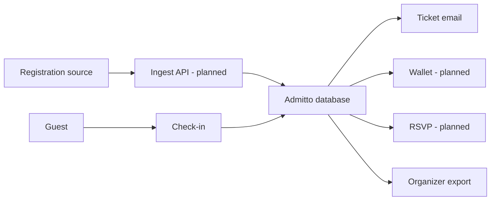

# Architecture for Auditors

Entry point for **scope, data flows, and design intent** in self-hosted Admitto deployments.
Detailed engineering decisions live in ADRs (where published); this document stays at the level
a mid-size company security or privacy reviewer typically needs.

**Deployment model:** [CORPORATE-DEPLOYMENT.md](CORPORATE-DEPLOYMENT.md)

> **Product maturity:** check [VERSIONING.md](../../VERSIONING.md) and the current release tag
> before assuming production readiness for a go-live timeline. Stability status is tracked
> there, not restated here, so this document doesn't go stale between releases.

---

## 1. Product scope

Admitto supports **internal corporate events**:

1. Import attendee lists (spreadsheet or agency identifiers).
2. Issue opaque ticket / QR tokens (no attendee name or email in the QR payload).
3. Send ticket email via customer mail infrastructure.
4. Check-in on event day (operator UI).
5. Export lists for reporting.

**Planned (not required for initial go-live):** wallet passes, registration ingest, RSVP flows.

**Out of MVP scope:** public self-registration portal, payments, CRM, vendor-hosted SaaS.

---

## 2. Logical architecture

The application and background worker are separate processes from the same container image (ADR
0042), not the same process under different threads. Only the application accepts inbound HTTP
traffic; the worker has no listening port and is not reachable from the edge. The worker runs
scheduled/queued jobs against the same database (mail delivery drain, bounce ingest, attendee
import commit, retention purges) and coordinates with the application over Redis (job locks, and
pub/sub so a worker-driven change reflects live in an open admin session without the operator
having to refresh).

---

## 3. Business flow (roadmap)

**Today:** import, mail, check-in, export are in scope for MVP UI. Ingest, RSVP, and wallet are
roadmap items — mention them to auditors as **planned**, not as deployed controls.

Admitto is intended as the **system of record for attendance** after guests are registered in the
customer process.

---

## 4. Exposure overview (generic)

| Area | Typical exposure | Mitigation approach |
|------|------------------|---------------------|
| Public ticket links | Internet | Opaque tokens; throttling; minimal data on page |
| Staff UIs | Restricted by customer network and/or app auth | RBAC; optional MFA; optional perimeter gateway |
| Admin APIs | Authenticated staff only | Scope checks on event/org; per-user throttling on heavy ops (import, template preview) |
| Superadmin OIDC config | Authenticated superadmin only | Outbound fetch SSRF guards + rate limits on discover/test |
| Database | Internal network | Not published to internet |
| Container image | Pulled by customer | Signed tags; CI scanning documented in SECURITY.md |
| Ops probes | Often internal/monitoring | `/healthz` rate-limited liveness; `/readyz` token-gated readiness |

Specific paths and headers are defined in deployment runbooks — not repeated here to avoid
coupling public docs to one customer's perimeter design.

---

## 5. Data categories (summary)

| Category | Storage | Notes |
|----------|---------|-------|
| Attendee PII | Customer PostgreSQL | Name, email, optional profile fields |
| Ticket secret | PostgreSQL (encrypted field) | Random identifier for QR |
| Check-in state | PostgreSQL | Operational |
| Mail credentials | PostgreSQL (encrypted) | Customer Graph / SMTP settings |
| Audit events | PostgreSQL + operational logs | Attendee data minimised in log lines; a small, named set of staff-accountability events (login, admin actions) logs the acting staff member's own email — see [DATA-PROTECTION.md](../../DATA-PROTECTION.md) |

Privacy detail: [DATA-PROTECTION.md](../../DATA-PROTECTION.md), [GDPR-ONE-PAGER.md](GDPR-ONE-PAGER.md).

---

## 6. Security and privacy documentation map

| Topic | Document |
|-------|----------|
| Configurable security capabilities | [SECURITY-CONTROLS.md](SECURITY-CONTROLS.md) — includes rate-limit matrix, `TRUST_PROXY` trust model, SSRF controls, PEN retest checklist |
| CI / image provenance | [SECURITY.md](../../SECURITY.md) |
| Hosting | [CORPORATE-DEPLOYMENT.md](CORPORATE-DEPLOYMENT.md) |
| Incidents | [INCIDENT-RESPONSE.md](INCIDENT-RESPONSE.md) |
| Subprocessors (template) | [SUBPROCESSORS.md](SUBPROCESSORS.md) |

---

## 7. If your reviewer uses a formal framework or questionnaire

Admitto is **self-hosted, no formal certification** (no SOC 2 report, no ISO 27001 certificate) —
that's normal for this size and stage of a vendor, not a red flag to hide. Being upfront about it,
and giving a reviewer something concrete to check instead, is what actually gets a review through:

- **A vendor security questionnaire (SIG Lite, CAIQ, or an internal equivalent):** the documents
  in the map above already answer most of the categories those cover — subprocessors, data flows,
  authentication/access controls, encryption, incident response, and supply-chain scanning. Point
  the reviewer at this document map rather than filling in a separate form from memory; the
  answers should match.
- **A technical/code-level review (pentest scoping, secure-SDLC checklist):** use the
  [OWASP Application Security Verification Standard (ASVS)](https://owasp.org/www-project-application-security-verification-standard/)
  as the reference checklist — it's a testing standard, not a certification, and maps directly onto
  what [SECURITY-CONTROLS.md](security/SECURITY-CONTROLS.md) already documents (authentication,
  session management, access control, input validation / SSRF handling, and so on).
- **A formal audit (SOC 2, ISO 27001):** Admitto does not have either. If your organization's
  policy requires one, that's a decision for whoever owns the vendor-risk process, not something
  this documentation set can substitute for.

## 8. Conscious exclusions (MVP)

Useful answers when enterprise checklists ask for features not in scope:

- Multi-region HA / automatic failover
- Built-in SIEM or SOC integration (log forwarding is customer-side)
- Automated enterprise IAM provisioning (OIDC supported; SCIM not in MVP)
- Vendor-operated penetration test (customer may commission independently before go-live)

---

## 9. Evidence artefacts (repository)

| Artefact | Location |
|----------|----------|
| Signed release tags | Project releases |
| Container SBOM | `.github/workflows/publish-container.yml` — Syft SBOM attached to release assets |
| Container vulnerability scan | `.github/workflows/publish-container.yml` — Trivy on built image |
| Static analysis SARIF (CodeQL) | `.github/workflows/codeql.yml` — `security-extended` on every PR |
| Static analysis SARIF (Semgrep) | `.github/workflows/semgrep.yml` — `--error` on every merge to `main` + weekly; intentionally not on PRs (CodeQL is the PR SAST gate; see [SECURITY.md](../../SECURITY.md)) |
| Code quality analysis (SonarCloud) | Automatic analysis on every PR and `main` push via GitHub App integration (`sonarcloud.io`), not a workflow file in this repo — see [SECURITY.md](../../SECURITY.md) || Migration safety checks | `.github/workflows/ci.yml` job `migration-safety` — `scripts/check-migrations-destructive.sh` on PRs |

Release **v0.4.3** added the corporate documentation pack. **CI trigger details** (PR vs `main`, required checks) are maintained in [SECURITY.md](../../SECURITY.md) — prefer that file over this table when answering audit questionnaires.
