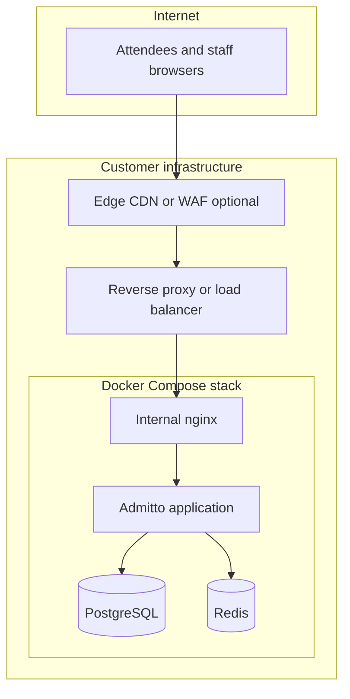

# Corporate Deployment Model

Admitto is an **internal event access gateway** deployed **on infrastructure controlled by the
customer**. There is **no multi-tenant SaaS**: each deployment is a dedicated instance with its
own database, secrets, and operator access.

> **You need a technical resource.** Admitto is not a click-to-install product. Deploying and
> maintaining it (see "What the customer provides" below) requires a developer or an IT
> contractor comfortable with Docker, a reverse proxy, and a mail relay. If you don't have that
> in-house, budget for one before committing to a go-live date.

> **Product maturity:** check [VERSIONING.md](../../VERSIONING.md) and the current release tag
> before committing to a go-live date. Stability status is tracked there, not restated here, so
> this document doesn't go stale between releases.

---

## Deployment model at a glance

| Aspect | Approach |
|--------|----------|
| Hosting | **Self-hosted** (customer VPC, private cloud, or on-premises) |
| SaaS | **No** — single-tenant per deployment |
| Data region | **Customer choice** (EU is the documented target for GDPR-oriented deployments) |
| Orchestration | **Docker Compose** (supported production path for MVP) |
| Container image | Published from signed semver tags on the project registry |
| Secrets | Customer `.env` / secret manager — never committed to git |

---

## What the customer provides

| Component | Role |
|-----------|------|
| **Application container** | Web API, admin UI, check-in UI |
| **PostgreSQL** | Primary data store (not exposed to the public internet) |
| **Redis** (recommended) | Sessions, rate limiting, caches |
| **Internal reverse proxy** | Bundled in compose; publishes loopback port to the host |
| **Edge TLS / public routing** | Customer reverse proxy, load balancer, or CDN |
| **DNS** | Customer-controlled |
| **Transactional email** | Customer Microsoft 365 / Graph and/or corporate SMTP relay |
| **Backups** | Customer policy (application supports pre-migration dump hooks) |
| **Monitoring** | Customer tools; application exposes liveness and token-gated readiness endpoints |

Optional **wallet pass** integration (planned) may add a third-party pass provider — see
[SUBPROCESSORS.md](SUBPROCESSORS.md).

---

## Reference topology

Typical mid-size or enterprise layout (components vary by customer):

**Common patterns:**

| Pattern | Examples | Notes |
|---------|----------|-------|
| Edge / CDN | Cloudflare, corporate CDN, WAF | TLS, DDoS, optional staff URL protection |
| Reverse proxy | nginx, **Nginx Proxy Manager**, HAProxy, cloud LB | Forwards to loopback port `8080` on the docker host |
| Private access | Corporate VPN, zero-trust client | Staff reach origin without public admin exposure |
| On-prem | No public CDN | Proxy on LAN; attendees may use separate public hostname |

The application origin should **not** be wide-open on the internet for staff functions — customers
define whether staff paths are VPN-only, zero-trust gated, or public with strong app auth.

---

## Data residency

- Attendee personal data, check-in records, and audit data remain in the **customer's PostgreSQL**.
- No central vendor database of customer events.
- Cross-border transfer is a **customer compliance** decision (region selection, DPA, SCCs).

---

## Roles and access paths

| Role | Typical user | Access |
|------|--------------|--------|
| Platform owner | IT / platform team | Admin UI; may combine with perimeter controls |
| Event organizer | Business owner | Admin UI, organization scope |
| Check-in operator | On-site staff | Operator UI, event scope |
| Attendee | Guest | Public ticket link — no account |

Initial platform administrator is created via documented bootstrap CLI inside the container.

---

## Upgrade and rollback

1. Pull the new container image tag.
2. Update compose image reference.
3. Restart stack — migrations run on startup with optional pre-migration backup.
4. Verify health endpoints.

Rollback: previous image tag (no schema change) or database restore from pre-migration backup.
Details in `deploy/README.md`.

---

## Documentation map for reviewers

| Topic | Document |
|-------|----------|
| CI / supply chain | [SECURITY.md](../../SECURITY.md) |
| Security capabilities | [SECURITY-CONTROLS.md](SECURITY-CONTROLS.md) |
| Architecture | [ARCHITECTURE-FOR-AUDITORS.md](ARCHITECTURE-FOR-AUDITORS.md) |
| Privacy | [DATA-PROTECTION.md](../../DATA-PROTECTION.md), [GDPR-ONE-PAGER.md](GDPR-ONE-PAGER.md) |
| Incidents | [INCIDENT-RESPONSE.md](INCIDENT-RESPONSE.md) |

---

## Explicit non-goals (MVP)

- Vendor-managed multi-tenant hosting
- Kubernetes as the only supported install path
- Built-in high availability across regions
