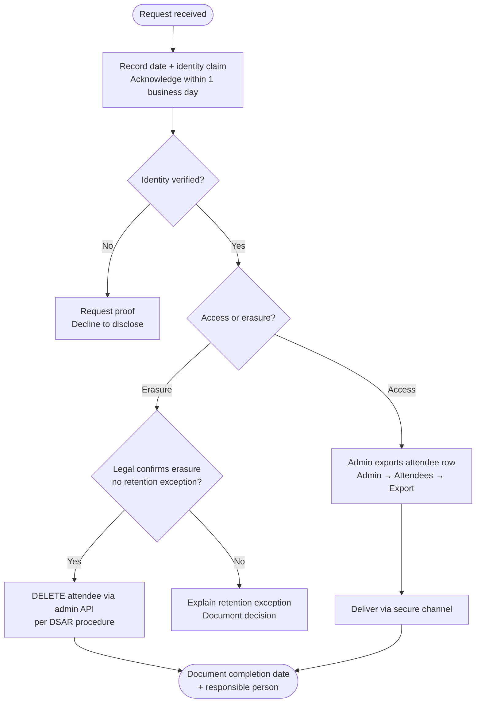

# Data Subject Access and Erasure - Organizer-Mediated Procedure (Option B)

Template for deployments that **do not** use self-service DSAR APIs. Adapt to your organisation's
privacy policy and legal sign-off. **Not legal advice.**

See also: [GDPR-ONE-PAGER.md](GDPR-ONE-PAGER.md) (Option B).

---

## Process overview



---

## 1. Intake

- Request arrives (email, helpdesk, in person) → record **date received**, requester identity, event.
- Privacy officer or designated organizer acknowledges receipt within **one business day**.

## 2. Verify identity

- Match requester to an attendee record (email, ticket reference, or ID checked by organizer).
- If identity cannot be verified, do not disclose data; explain what proof is required.

## 3. Access (export)

- Organizer with `admin` role exports the attendee row via **Admin → Attendees → Export**
  (CSV/XLSX/PDF, filtered to the data subject if needed).
- Deliver export through your organisation's **secure channel** (encrypted mail, ticket system).
- Log: who exported, when, which event - use your internal audit process.

## 4. Erasure

- After legal confirms erasure is required and no retention exception applies:
  1. Delete the attendee record. Both paths below call the same `DELETE`/`bulk-delete`
     `/api/admin/events/:eventId/attendees/...` endpoints used by the API client below, and both
     work even when the event is archived.
     - **Single-attendee deletion:** **Admin → Attendees → attendee detail → More actions →
       Delete attendee**, typing the attendee's name to confirm.
     - **Bulk deletion:** select the rows on the **Attendees** list, then **More actions → Delete**
       from the bulk bar. A confirmation dialog lists what will be removed; there's no typed-name
       confirmation here since there's no single name to type, unlike the single-attendee flow.
     - **What gets removed and audited:** dependent delivery, wallet, and check-in rows are removed
       in one transaction. An audit log entry is written per-attendee, plus a central
       admin-audit-log entry naming the erased attendee(s) and event. See
       [DATA-PROTECTION.md](../../DATA-PROTECTION.md#central-admin-audit-log-adminauditlog) for why
       the central entry retains identity, unlike the per-attendee trail.
     - **Direct-API fallback:** if the SPA is unavailable, call the endpoint directly with an
       authenticated staff session and CSRF token (same session model as other admin mutations).
  2. Remove copies from local exports, mail logs, and backup retention per your backup policy.
- Document completion date and responsible person.

### Manual DB erasure (fallback)

If the API is unavailable, operators may erase by direct database operation. Dependent rows must be
removed before the attendee because `EmailDelivery`, `WalletPass`, and `CheckIn` reference attendees
with `ON DELETE RESTRICT`. Sent delivery rows can include rendered ticket email HTML.

> **Warning: this bypasses both audit writers the API path uses** (the per-attendee
> `AttendeeActionLog` entry and the central `AdminAuditLog` entry - see
> [DATA-PROTECTION.md](../../DATA-PROTECTION.md#central-admin-audit-log-adminauditlog)). A manual
> erasure with no central audit record is exactly the accountability gap that log exists to close.
> The `INSERT` below writes the same central record by hand; do not skip it.

Before you run this:

1. Capture the attendee's name and email, and the event's title, *before* the delete. The `SELECT`
   in the transaction below does this.
2. Know your own `user_id` (`SELECT id FROM "User" WHERE email = '...'`).
3. Know the event's `organization_id` beforehand.

Run the operation in one transaction and scope it to the event and attendee:

```sql
BEGIN;

-- Replace values before execution.
\set event_id 'evt_...'
\set attendee_id 'att_...'
\set actor_user_id 'usr_...'

-- Snapshot identity for the audit record before it's gone.
SELECT id, name, email FROM "Attendee" WHERE id = :'attendee_id' AND event_id = :'event_id';
SELECT organization_id, title FROM "Event" WHERE id = :'event_id';

DELETE FROM "EmailDelivery"
WHERE "event_id" = :'event_id'
  AND "attendee_id" = :'attendee_id';

DELETE FROM "WalletPass"
WHERE "attendee_id" = :'attendee_id';

DELETE FROM "CheckIn"
WHERE "event_id" = :'event_id'
  AND "attendee_id" = :'attendee_id';

DELETE FROM "Attendee"
WHERE "event_id" = :'event_id'
  AND "id" = :'attendee_id';

-- Central accountability record - fill in the values from the two SELECTs above.
INSERT INTO "AdminAuditLog" (id, organization_id, actor_user_id, action_type, metadata, created_at)
VALUES (
  gen_random_uuid()::text,
  '<organization_id from the Event SELECT>',
  :'actor_user_id',
  'attendee_erased',
  jsonb_build_object(
    'event_id', :'event_id',
    'event_title', '<title from the Event SELECT>',
    'attendee_id', :'attendee_id',
    'attendee_name', '<name from the Attendee SELECT>',
    'attendee_email', '<email from the Attendee SELECT>'
  ),
  now()
);

COMMIT;
```

If the final `DELETE FROM "Attendee"` affects zero rows, roll back and re-check the event/attendee
ids before recording completion.

## 5. SLA (customer-defined)

| Step | Suggested target |
|------|------------------|
| Acknowledge request | 1 business day |
| Fulfill access / erasure | Per applicable law (e.g. **one month** under GDPR Art. 12(3); shorten internally if policy requires) |

---

## Related documents

- [GDPR-ONE-PAGER.md](GDPR-ONE-PAGER.md)
- [DATA-PROTECTION.md](../../DATA-PROTECTION.md)
- [INCIDENT-RESPONSE.md](INCIDENT-RESPONSE.md)
