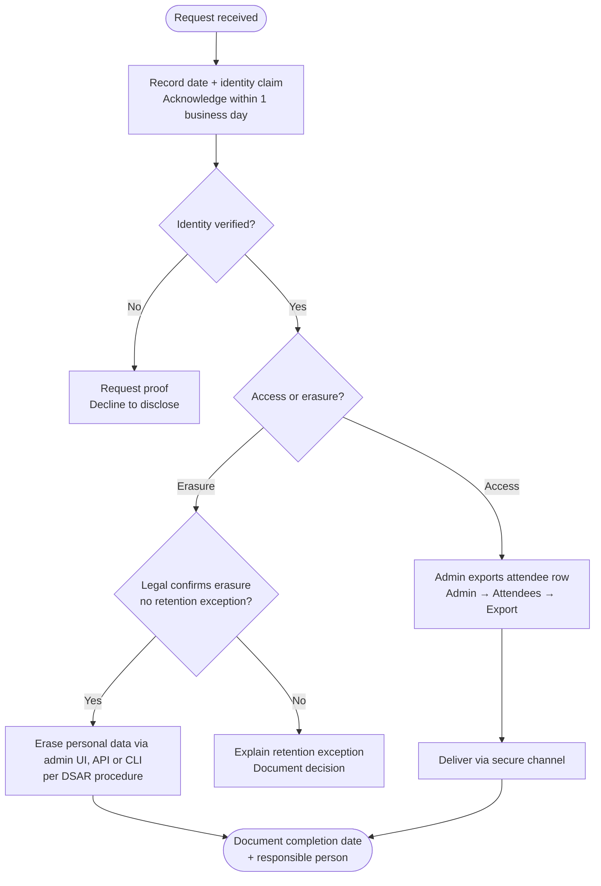

# Data Subject Access and Erasure - Organizer-Mediated Procedure (Option B)

Template for deployments that **do not** use self-service DSAR APIs. Adapt to your organisation's
privacy policy and legal sign-off. **Not legal advice.**

See also: [GDPR-ONE-PAGER.md](GDPR-ONE-PAGER.md) (Option B).

---

## Process overview

```mermaid
flowchart TD
    A([Request received]) --> B[Record date + identity claim\nAcknowledge within 1 business day]
    B --> C{Identity verified?}
    C -- No --> D[Request proof\nDecline to disclose]
    C -- Yes --> E{Access or erasure?}
    E -- Access --> F[Admin exports attendee row\nAdmin → Attendees → Export]
    F --> G[Deliver via secure channel]
    E -- Erasure --> H{Legal confirms erasure\nno retention exception?}
    H -- No --> I[Explain retention exception\nDocument decision]
    H -- Yes --> J[Erase personal data via admin UI, API or CLI\nper DSAR procedure]
    J --> K([Document completion date\n+ responsible person])
    G --> K
```

---

## 1. Intake

- Request arrives (email, helpdesk, in person) → record **date received**, requester identity, event.
- Privacy officer or designated organizer acknowledges receipt within **one business day**.

## 2. Verify identity

- Match requester to an attendee record (email, ticket reference, or ID checked by organizer).
- If identity cannot be verified, do not disclose data; explain what proof is required.

## 3. Access (export)

- Organizer with `admin` role exports the attendee row via **Admin → Attendees → Export**
  (CSV/XLSX/PDF, filtered to the data subject if needed).
- Deliver export through your organisation's **secure channel** (encrypted mail, ticket system).
- Log: who exported, when, which event - use your internal audit process.

## 4. Erasure

- After legal confirms erasure is required and no retention exception applies:
  1. **Erase the person's personal data (the recommended path).** It anonymises the attendee in
     place: the entry stays in Reports as an anonymous attendee, so the Reports totals do not
     change. Capacity does change by one place: a person who had not checked in yet, on an event that
     is not archived, is marked cancelled, so their place becomes free. Nothing that identifies the
     person or opens their ticket is left (name, email,
     company, notes, custom answers, ticket link, copies of the messages sent, the wallet pass at
     the provider, and the person's address in saved import results). It works when the event is
     archived. See [attendee-erasure.md](../dev/attendee-erasure.md) for exactly what is erased.
     - **Single attendee:** **Admin → Attendees → attendee detail → More actions → Erase personal
       data**, typing the attendee's name to confirm.
     - **Several attendees:** select the rows on the **Attendees** list, then **More actions →
       Erase personal data** from the bulk bar (no typed name: there is no single name to type).
     - **Files still to import:** Admitto keeps nothing that identifies an erased person, so it cannot
       refuse a file that lists them. An import or an export of the event that is still waiting or running is
       stopped by the erasure, but a file that someone uploads afterwards adds the person back. Remove them
       from any spreadsheet that is still to be imported.
     - **Wallet pass:** if the provider cannot be reached, a dialog says the pass is still there and
       offers **Try again**, which repeats only the wallet step; the attendee's page keeps a **Try
       again** button until it has worked. Everything personal inside Admitto is gone either way.
     - **Audit:** the event action log and the central admin audit log record who erased how many
       people and which ids, never a name or an address.
     - **Direct-API fallback:** `POST /api/admin/events/:eventId/attendees/:id/erase`, or
       `POST /api/admin/events/:eventId/attendees/bulk-erase` with `{ "attendeeIds": [...] }`, with an
       authenticated staff session and CSRF token. Repeating a request for people who are already
       erased changes nothing and only tries the pending wallet deletes again.
     - **No admin UI or API at all:** the emergency CLI, see [Erasure without the admin UI](#erasure-without-the-admin-ui-cli-fallback).
  2. For an entry that should never have existed (a duplicate, a test person, a row from the wrong
     import file), use **Remove from event** instead. It deletes the attendee for good, so Reports
     change with it. It is not the way to answer a privacy request, and it is refused on an archived
     event, whose numbers are final (an archived event is still answered with step 1).
     - **Single attendee:** **Admin → Attendees → attendee detail → More actions → Remove from
       event**, choosing a reason and typing the attendee's name to confirm.
     - **Several attendees:** select the rows on the **Attendees** list, then **More actions →
       Remove from event** from the bulk bar, choosing a reason (no typed name: there is no single
       name to type).
     - **What gets removed and audited:** dependent delivery, wallet, and check-in rows are removed
       in one transaction, and the notes and the attendee's own activity log go with the row. The
       address is also blanked on mail that staff addressed to the person on behalf of another
       attendee, and in the saved results of the event's imports. An event-level action-log entry
       records the removal (`attendee_erased`, or one `attendees_bulk_erased` entry for a bulk
       removal, told apart from an erasure by `method: "remove"`), plus a central admin-audit-log
       entry (one per single removal, one per bulk request): the reason code, the attendee ids and
       the removed-row counts only, never a name or email. The name and email in the person's
       creation entry of the central log are blanked too. Entries written by the old hard delete,
       before Erase and Remove were separate, still hold them: see
       [DATA-PROTECTION.md](../../DATA-PROTECTION.md#central-admin-audit-log-adminauditlog) for how
       to blank those after your retention window.
     - **Wallet pass at the provider:** before the local delete, Admitto also asks the wallet
       provider to delete each removed attendee's pass, so their name no longer sits there. This is
       best effort: if a provider call fails, the attendee is still removed locally and a
       `wallet_pass_erasure_delete_failed` entry appears in **System logs** (live tail,
       superadmin). Check that log after a removal and remove any remaining pass by hand in the
       provider's own console. **Nothing is sent, and no failure entry is written,** when the
       event's wallet template or API key is no longer configured (for example removed after the
       pass was issued). In that case restore the credentials in Event Settings → Wallet before
       removing, or delete the attendee's pass in the provider's own console yourself: once the
       local row is gone, Admitto no longer knows which provider pass belonged to the attendee.
     - **Direct-API fallback:** if the SPA is unavailable, call
       `POST /api/admin/events/:eventId/attendees/:id/remove` with `{ "reason": "duplicate" }`, or
       `POST /api/admin/events/:eventId/attendees/bulk-remove` with `{ "attendeeIds": [...],
       "reason": "duplicate" }` (the reasons are `duplicate`, `test_person`, `wrong_import`,
       `added_by_mistake` and `other`), with an authenticated staff session and CSRF token (same
       session model as other admin mutations).
  3. Remove copies from local exports, mail logs, and backup retention per your backup policy.
- Document completion date and responsible person.

### Erasure without the admin UI (CLI fallback)

A privacy request does not wait for the admin UI. When the UI and the API cannot be reached, but the database
can, run the emergency CLI from the same image the app runs from. It does what the erase API does: it anonymises
the attendees in place, blanks their addresses in saved import results, writes the same audit entries (marked
`source: "cli"`), deletes the files the event's exports and imports left in storage, and deletes each attendee's wallet pass at the provider.

1. Find the attendee ids: `docker compose run --rm app node apps/cli/dist/index.js checkin lookup --event <eventId> --query "<name or email>"`.
2. Preview: `docker compose run --rm app node apps/cli/dist/index.js attendees erase --event <eventId> --attendee-ids <id>[,<id>...] --operator-email <your superadmin email> --dry-run`
   says how many would be erased, how many are erased already and how many ids match nobody, and changes nothing.
3. Erase: the same command without `--dry-run`. It asks you to type `yes` first (`--yes` skips the question, for a
   script). Up to 500 ids at a time.

- **Audit:** the event action log and the central admin audit log record who erased how many people and which ids
  (`method: "erase"`, `source: "cli"`), never a name or an address. `--operator-email` is required for the real run
  and names the actor.
- **Wallet pass:** if the provider cannot be reached, or the event's wallet credentials are no longer set, the
  command prints how many passes are still there and exits with code 2. Run the same command again (people who are
  already erased are left alone and only their passes are tried again), or let the worker's daily retention run do
  it. If a pass keeps failing, fix the wallet credentials in Event settings or delete the pass in the provider's own console.
- **Open admin screens** show the change within 30 seconds (the CLI does not notify them).
- **Not offered here:** **Remove from event** (a hard delete for mistakes) stays in the admin UI and API: it changes
  Reports and is not an emergency. The old manual SQL delete is gone: it bypassed both audit writers and the wallet
  provider, and it removed the entry instead of erasing the personal data.

## 5. SLA (customer-defined)

| Step | Suggested target |
|------|------------------|
| Acknowledge request | 1 business day |
| Fulfill access / erasure | Per applicable law (e.g. **one month** under GDPR Art. 12(3); shorten internally if policy requires) |

---

## Related documents

- [GDPR-ONE-PAGER.md](GDPR-ONE-PAGER.md)
- [DATA-PROTECTION.md](../../DATA-PROTECTION.md)
- [INCIDENT-RESPONSE.md](INCIDENT-RESPONSE.md)
