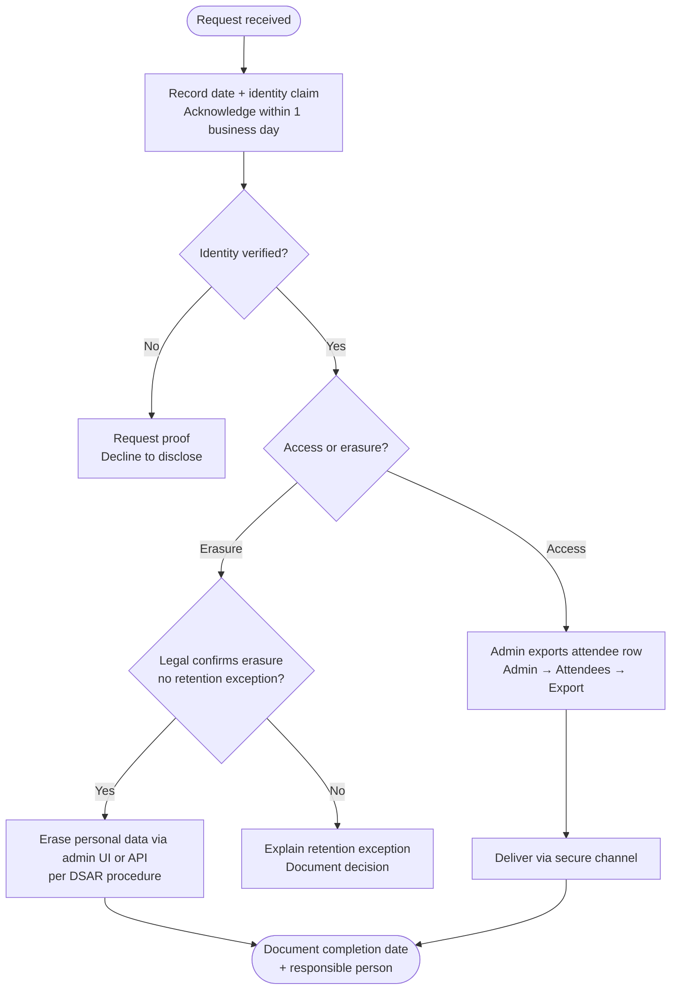

# Data Subject Access and Erasure - Organizer-Mediated Procedure (Option B)

Template for deployments that **do not** use self-service DSAR APIs. Adapt to your organisation's
privacy policy and legal sign-off. **Not legal advice.**

See also: [GDPR-ONE-PAGER.md](GDPR-ONE-PAGER.md) (Option B).

---

## Process overview


```mermaid
flowchart TD
    A([Request received]) --> B[Record date + identity claim\nAcknowledge within 1 business day]
    B --> C{Identity verified?}
    C -- No --> D[Request proof\nDecline to disclose]
    C -- Yes --> E{Access or erasure?}
    E -- Access --> F[Admin exports attendee row\nAdmin → Attendees → Export]
    F --> G[Deliver via secure channel]
    E -- Erasure --> H{Legal confirms erasure\nno retention exception?}
    H -- No --> I[Explain retention exception\nDocument decision]
    H -- Yes --> J[Erase personal data via admin UI or API\nper DSAR procedure]
    J --> K([Document completion date\n+ responsible person])
    G --> K
```

---

## 1. Intake

- Request arrives (email, helpdesk, in person) → record **date received**, requester identity, event.
- Privacy officer or designated organizer acknowledges receipt within **one business day**.

## 2. Verify identity

- Match requester to an attendee record (email, ticket reference, or ID checked by organizer).
- If identity cannot be verified, do not disclose data; explain what proof is required.

## 3. Access (export)

- Organizer with `admin` role exports the attendee row via **Admin → Attendees → Export**
  (CSV/XLSX/PDF, filtered to the data subject if needed).
- Deliver export through your organisation's **secure channel** (encrypted mail, ticket system).
- Log: who exported, when, which event - use your internal audit process.

## 4. Erasure

- After legal confirms erasure is required and no retention exception applies:
  1. **Erase the person's personal data (the recommended path).** It anonymises the attendee in
     place: the entry stays in Reports as an anonymous attendee, so counts and capacity do not
     change, and nothing that identifies the person or opens their ticket is left (name, email,
     company, notes, custom answers, ticket link, copies of the messages sent, the wallet pass at
     the provider, and the person's address in saved import results). It works when the event is
     archived. See [attendee-erasure.md](../dev/attendee-erasure.md) for exactly what is erased.
     - **Single attendee:** **Admin → Attendees → attendee detail → More actions → Erase personal
       data**, typing the attendee's name to confirm.
     - **Several attendees:** select the rows on the **Attendees** list, then **More actions →
       Erase personal data** from the bulk bar (no typed name: there is no single name to type).
     - **Wallet pass:** if the provider cannot be reached, a dialog says the pass is still there and
       offers **Try again**, which repeats only the wallet step; the attendee's page keeps a **Try
       again** button until it has worked. Everything personal inside Admitto is gone either way.
     - **Audit:** the event action log and the central admin audit log record who erased how many
       people and which ids, never a name or an address.
     - **Direct-API fallback:** `POST /api/admin/events/:eventId/attendees/:id/erase`, or
       `POST /api/admin/events/:eventId/attendees/bulk-erase` with `{ "attendeeIds": [...] }`, with an
       authenticated staff session and CSRF token. Repeating a request for people who are already
       erased changes nothing and only tries the pending wallet deletes again.
  2. Alternatively, **delete the attendee record entirely**. This is for mistakes, duplicates and
     test people, because Reports change with it. Both paths below call the same `DELETE`/`bulk-delete`
     `/api/admin/events/:eventId/attendees/...` endpoints used by the API client below, and both
     work even when the event is archived.
     - **Single-attendee deletion:** **Admin → Attendees → attendee detail → More actions →
       Delete attendee**, typing the attendee's name to confirm.
     - **Bulk deletion:** select the rows on the **Attendees** list, then **More actions → Delete**
       from the bulk bar. A confirmation dialog lists what will be removed; there's no typed-name
       confirmation here since there's no single name to type, unlike the single-attendee flow.
     - **What gets removed and audited:** dependent delivery, wallet, and check-in rows are removed
       in one transaction. An event-level action-log entry records the erasure (`attendee_erased`, or one
       `attendees_bulk_erased` entry for a bulk delete; attendee ids and removed-row counts only, no
       name or email), plus a central admin-audit-log entry (one per single erasure, one per bulk
       request listing every erased attendee) naming the erased attendee(s) and event. See
       [DATA-PROTECTION.md](../../DATA-PROTECTION.md#central-admin-audit-log-adminauditlog) for why
       the central entry retains identity, unlike the event-level trail.
     - **Wallet pass at the provider:** after the local delete, Admitto also asks the wallet
       provider to delete each erased attendee's pass, so their name no longer sits there. This is
       best effort: if a provider call fails, the attendee is still erased locally and a
       `wallet_pass_erasure_delete_failed` entry appears in **System logs** (live tail,
       superadmin). Check that log after an erasure and remove any remaining pass by hand in the
       provider's own console. **Nothing is sent, and no failure entry is written,** when the
       event's wallet template or API key is no longer configured (for example removed after the
       pass was issued). In that case restore the credentials in Event Settings → Wallet before
       erasing, or delete the attendee's pass in the provider's own console yourself: once the local
       row is gone, Admitto no longer knows which provider pass belonged to the attendee.
     - **Direct-API fallback:** if the SPA is unavailable, call the endpoint directly with an
       authenticated staff session and CSRF token (same session model as other admin mutations).
  3. Remove copies from local exports, mail logs, and backup retention per your backup policy.
- Document completion date and responsible person.

### Manual DB erasure (fallback)

If the API is unavailable, operators may erase by direct database operation. Dependent rows must be
removed before the attendee because `EmailDelivery`, `WalletPass`, and `CheckIn` reference attendees
with `ON DELETE RESTRICT`. Sent delivery rows can include rendered ticket email HTML. A direct database erasure also does not
contact the wallet provider, so delete any wallet pass of the erased attendee in the provider's own
console yourself.

> **Warning: this bypasses both audit writers the API path uses** (the event-level
> `AttendeeActionLog` erasure entry and the central `AdminAuditLog` entry - see
> [DATA-PROTECTION.md](../../DATA-PROTECTION.md#central-admin-audit-log-adminauditlog)). A manual
> erasure with no central audit record is exactly the accountability gap that log exists to close.
> The `INSERT` below writes the same central record by hand; do not skip it.

Before you run this:

1. Capture the attendee's name and email, and the event's title, *before* the delete. The `SELECT`
   in the transaction below does this.
2. Know your own `user_id` and identity (`SELECT id, email, display_name FROM "User" WHERE email = '...'`).
   The API path stores your email and display name in the record so it stays readable if your
   account is deleted later; the `INSERT` below does the same.
3. Know the event's `organization_id` beforehand.

Run the operation in one transaction and scope it to the event and attendee:

```sql
BEGIN;

-- Replace values before execution.
\set event_id 'evt_...'
\set attendee_id 'att_...'
\set actor_user_id 'usr_...'

-- Snapshot identity for the audit record before it's gone.
SELECT id, name, email FROM "Attendee" WHERE id = :'attendee_id' AND event_id = :'event_id';
SELECT organization_id, title FROM "Event" WHERE id = :'event_id';

DELETE FROM "EmailDelivery"
WHERE "event_id" = :'event_id'
  AND "attendee_id" = :'attendee_id';

DELETE FROM "WalletPass"
WHERE "attendee_id" = :'attendee_id';

DELETE FROM "CheckIn"
WHERE "event_id" = :'event_id'
  AND "attendee_id" = :'attendee_id';

DELETE FROM "Attendee"
WHERE "event_id" = :'event_id'
  AND "id" = :'attendee_id';

-- Central accountability record - fill in the values from the SELECTs above (`ip` and `session_id` may stay NULL).
INSERT INTO "AdminAuditLog" (id, organization_id, actor_user_id, actor_email, actor_display_name, action_type, metadata, created_at)
VALUES (
  gen_random_uuid()::text,
  '<organization_id from the Event SELECT>',
  :'actor_user_id',
  '<your email>',
  '<your display name, or NULL>',
  'attendee_erased',
  jsonb_build_object(
    'event_id', :'event_id',
    'event_title', '<title from the Event SELECT>',
    'attendee_id', :'attendee_id',
    'attendee_name', '<name from the Attendee SELECT>',
    'attendee_email', '<email from the Attendee SELECT>'
  ),
  now()
);

COMMIT;
```

If the final `DELETE FROM "Attendee"` affects zero rows, roll back and re-check the event/attendee
ids before recording completion.

## 5. SLA (customer-defined)

| Step | Suggested target |
|------|------------------|
| Acknowledge request | 1 business day |
| Fulfill access / erasure | Per applicable law (e.g. **one month** under GDPR Art. 12(3); shorten internally if policy requires) |

---

## Related documents

- [GDPR-ONE-PAGER.md](GDPR-ONE-PAGER.md)
- [DATA-PROTECTION.md](../../DATA-PROTECTION.md)
- [INCIDENT-RESPONSE.md](INCIDENT-RESPONSE.md)
