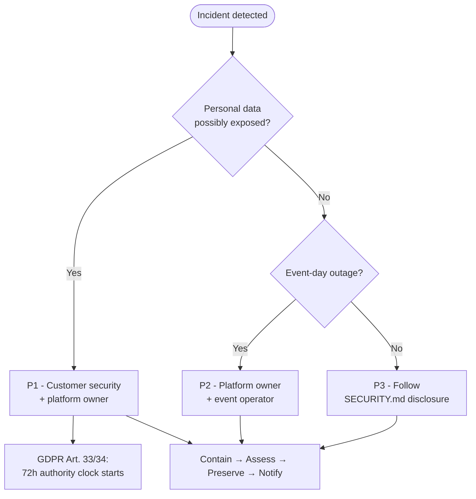

# Incident Response (One-Pager)

Template for security and availability incidents in a **self-hosted** Admitto deployment.
Assign names and contacts in your internal runbook.

- [Triage](#triage)
- [Severity](#severity)
- [First 30 minutes](#first-30-minutes)
- [Secret rotation](#secret-rotation)
- [Rollback](#rollback)
- [Health checks](#health-checks)
- [Aftercare](#aftercare)
  - [Post-incident review](#post-incident-review)
- [Related documents](#related-documents)

---

## Triage



## Severity

| Level | Examples | Lead |
|-------|----------|------|
| **P1** | Suspected data breach, leaked production secrets | Customer security + platform owner |
| **P2** | Outage on event day, mail or database unavailable | Platform owner + event operator |
| **P3** | Vulnerability in Admitto or dependencies | Follow [SECURITY.md](../../SECURITY.md) disclosure |

---

## First 30 minutes

1. **Contain** - rotate exposed secrets; disable compromised accounts; block abusive traffic at edge.
2. **Assess** - admin audit log, readiness probe, mail delivery log, recent deployments, and the
   two log sources below.
   - **Security log** (Organisation settings → Logs → Security, superadmin only):
     durable login/MFA/logout/OIDC/access-denied history. It survives a restart, so prefer it over
     the live tail below for reconstructing what happened. Writes are best-effort though, so a DB
     hiccup at the moment of the event can leave a gap even though the underlying auth action
     itself succeeded, and rows past the retention window (30 days by default) are gone.
   - **System logs** live tail (Organisation settings → Logs → System, superadmin only): shows recent
     activity in near real time, but only the last 1000 entries, and only while the server process
     is still running.
3. **Preserve** - snapshot logs and database if investigation is likely.
4. **Notify** - privacy officer if personal data may be affected. Under **GDPR Art. 33** (when
   applicable), notify the supervisory authority **without undue delay and, where feasible, within
   72 hours** of becoming aware of a personal-data breach - unless the breach is unlikely to result
   in a risk to individuals. Notify affected data subjects when required (**Art. 34**). Record
   timeline, scope, and decision in your internal breach register.

---

## Secret rotation

Treat any secret exposed in logs, tickets, or version control as **compromised**:

| Secret type | Action |
|-------------|--------|
| Database password | Rotate in database and deployment config; restart services |
| Mail integration | Rotate in M365 / SMTP provider and application settings |
| Encryption key | Major incident - plan re-encryption with maintenance window |
| Redis password | Change `REDIS_PASSWORD` and the password inside `REDIS_URL` together, then recreate `redis`, `app` and `worker` |
| Wallet provider (PassCreator) API key | Rotate at the provider, then paste the new key in Event Settings → Wallet for each event |
| SSO client secret | Rotate at the identity provider, then update the provider under Settings → Identity |
| Alert webhook URL | Regenerate at Discord, Slack or the receiving service, then update Organisation Settings → Notifications (the URL is itself a bearer-style secret) |
| Emergency check-in token | Change `CHECKIN_OPERATOR_TOKEN` (or leave `ALLOW_CHECKIN_BEARER` unset) and recreate `app` |
| Monitoring token | Regenerate and update observability tools |
| Session compromise | Invalidate active sessions; force staff re-authentication. For a lost or stolen check-in tablet, revoke its session in **Users & roles** (the user's active sessions) straight away: an operator who signed in on the day of their event stays signed in, with no inactivity timeout, until 06:00 the next morning (or the event's end time if later), and operator accounts have no second factor unless a superadmin added the `operator` role to the required-MFA list (not the default). A superadmin can also turn off **Operators stay signed in on event day** in Settings → Security: that stops new such sessions and puts the normal two-hour inactivity limit back on existing ones at once, but it does not shorten their end time, so a tablet that is still being used stays signed in until then. If the web UI is unreachable, run `docker compose run --rm app node apps/cli/dist/index.js sessions revoke --user <email> --operator-email <superadmin email>` (or `sessions purge --all --yes --operator-email <superadmin email>` for every user) |

See [SECURITY.md](../../SECURITY.md) for the project secret policy.

---

## Rollback

| Situation | Action |
|-----------|--------|
| Bad application release, schema unchanged | Deploy previous container image tag |
| Failed database migration | Restore pre-upgrade or nightly backup; redeploy previous image |

Procedure detail: `deploy/README.md` (rollback runbook).

---

## Health checks

```bash
curl -fsS https://<your-host>/healthz
curl -fsS -H "Authorization: Bearer <readiness-token>" https://<your-host>/readyz
```

Readiness output is intended for operators - no personal data in responses.

---

## Aftercare

1. Root cause and timeline - see **Post-incident review** below for how deep this needs to go.
2. Update runbook or perimeter controls if needed.
3. Privacy / DPO sign-off when personal data was involved (include 72h authority notification decision if GDPR applies).
4. Patch dependencies or deploy hotfix release if applicable.

### Post-incident review

- **P1:** always write one. Circulate to customer security + platform owner within 5 business days.
- **P2:** always write one, less formally - a few paragraphs is enough. Circulate to platform owner + event operator.
- **P3:** a review is optional; the [SECURITY.md](../../SECURITY.md) disclosure record itself usually covers it.

Keep it short and blameless - a paragraph per section, not a full report:

- **What happened** - plain-language summary, who noticed it and how.
- **Timeline** - detection, containment, resolution, each with a timestamp.
- **Root cause** - the actual mechanism, not just "human error."
- **Impact** - what broke, for whom, for how long; personal data involved, if any.
- **What we're changing** - the concrete follow-up (a runbook update, a new alert, a code fix) with an owner. If there's nothing to change, say why.

---

## Related documents

- [SECURITY.md](../../SECURITY.md)
- [SECURITY-CONTROLS.md](SECURITY-CONTROLS.md)
- [DATA-PROTECTION.md](../../DATA-PROTECTION.md)
- [CORPORATE-DEPLOYMENT.md](CORPORATE-DEPLOYMENT.md)
