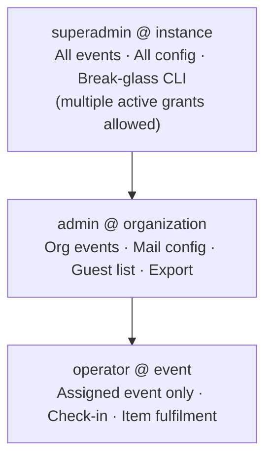

# Security Controls (Application)

This document describes **security capabilities** that Admitto supports in typical
self-hosted deployments. It is written for **privacy officers, security reviewers, and operators**
at mid-size and enterprise organizations.

For **repository CI** (SAST, secret scan, container scan, SBOM), see [SECURITY.md](../../SECURITY.md).
For **hosting and data residency**, see [CORPORATE-DEPLOYMENT.md](CORPORATE-DEPLOYMENT.md).

> **How to read this:** rows describe what organizations commonly require and how Admitto can be
> configured — not a checklist of what any single deployment must enable. Your runbook and
> environment variables define the effective control set.
>
> **`Where` column:** **App** = built into the application; **Config** = available but must be
> enabled or tuned in deployment settings; **Operator** = customer infrastructure or process
> (reverse proxy, disk encryption, perimeter, runbooks).

---

## Control areas (summary)

| Area | Typical enterprise expectation | Admitto support | Where |
|------|-------------------------------|-----------------|-------|
| Authentication | Staff sign-in before admin/operator actions | Local accounts and/or **OIDC** | App · Config |
| Authorization | Least privilege by role and event/org scope | **RBAC** (admin, operator, platform roles) | App |
| Strong auth | MFA for privileged users | **TOTP** for elevated roles | App · Config |
| Edge access (ZTNA) | Restrict staff URLs at the perimeter, so an unauthorized request never reaches the application at all | Optional zero-trust network access (ZTNA) gateway — e.g. **Cloudflare Access** — in front of staff paths. Verifies identity (via the same OIDC provider or its own) and device posture before proxying the request through; complements, does not replace, Admitto's own RBAC | Operator |
| Session security | HttpOnly cookies, TLS, rotation | Configurable lifetime; server-side revocation | App · Config |
| CSRF | Protect state-changing browser requests | Same-origin checks on mutating requests (behind standard reverse proxy) | App |
| Abuse prevention | Rate limits on auth, public, ops, and admin surfaces | Per-route throttling (see **Rate limiting** below; shared Redis store recommended in production) | App · Config |
| Outbound fetch safety | Block SSRF from OIDC / JWKS admin actions | Hostname blocklist + DNS resolve-before-connect on outbound HTTP | App |
| Secrets | No credentials in source code | Env / secret manager; integration secrets encrypted in DB | App · Operator |
| Data at rest | Protect tickets and integration secrets | Field-level encryption for sensitive data; **disk encryption** | App · Operator |
| Transport | TLS to users | Terminated at customer **reverse proxy, load balancer, or CDN** | Operator |
| Logging | Minimise personal data in logs | Redacted identifiers in audit output; no secrets in log lines; a superadmin-only live tail of recent activity (see **System logs** in [DATA-PROTECTION.md](../../DATA-PROTECTION.md)) | App |
| Supply chain | Scans on code and container image | Documented in [SECURITY.md](../../SECURITY.md) | App |

---

## Authentication and access

### Role hierarchy

**Staff surfaces** (administration, check-in) require authentication. Deployments may use:

- **Local accounts** with password and optional MFA for privileged roles.
- **OIDC / SSO** (optional) alongside a local break-glass administrator account.
- **Perimeter access control** (optional) — e.g. corporate zero-trust gateway, VPN, or CDN access
  rules in front of staff URLs. This complements, but does not replace, application RBAC.

Sessions are **server-side** (opaque token, hash stored in the database). Cookie flags follow
common web hardening (`httpOnly`, `SameSite`, `secure` in production).
Expired or revoked session and trusted-device rows are purged best-effort on the Admitto **worker**
(at boot and about every 24 hours). Operators can also run
`npm run cli -w @admitto/auth -- purge-auth-retention` (use `--dry-run` first
to preview counts).
**Trusted-device revocation on logout.** Signing out (`POST /logout` in the staff UI, or
`POST /api/auth/logout`) revokes the `admitto_trusted_device` cookie and its database row for
that browser, in addition to the session itself. The next sign-in on that browser requires MFA
again unless the user checks **"Remember this device"** during verification. This is intentional:
the trusted-device cookie must not silently persist past a sign-out on a browser other people may
use next.

> **Shared check-in devices.** On shared operator tablets, sign out before handing the device to
> the next person — logout is what clears the remembered-device state; simply closing the browser
> or app does not. Instance operators can also shorten or disable trusted-device persistence
> entirely via the `trusted_device_days` setting (`0` disables the feature).
Frozen email delivery bodies (`EmailDelivery.rendered_html` / `rendered_subject`) are nullified
best-effort on the Admitto **worker** (boot + ~24h) once a delivery is terminal and older than 60 days
(configurable via `EMAIL_DELIVERY_SNAPSHOT_RETENTION_DAYS`). Preview with
`npm run cli -w @admitto/mail-delivery -- nullify-delivery-snapshots --dry-run`.

**Session idle timeout (v0.4.13+).** Sessions previously only expired on an absolute lifetime
(admin defaulted to 7 days), with no inactivity check — a stolen or left-open admin browser tab
stayed authenticated for up to a week. A `full`-stage session now also ends once `now -
last_seen_at` exceeds a configurable idle window (`SESSION_IDLE_TIMEOUT_ADMIN_MS` /
`SESSION_IDLE_TIMEOUT_OPERATOR_MS`, same env-lock pattern as the absolute-lifetime settings).
Defaults: admin 30 min idle / 12h absolute (down from 7 days); operator 2h idle / 12h absolute.
Settings → Security warns inline when either an absolute lifetime or an idle timeout is set past a
sane threshold, and the API rejects a save where the idle timeout would exceed that role's own
absolute lifetime.

**Password blocklist (v0.4.13+).** Every place a password is set or changed (first-run setup, forced
change, self-service Account change, admin-initiated create/reset) now rejects the ~250 most common
passwords and trivial patterns (a single repeated character, a simple ascending/descending run) —
enforced server-side, not just the strength meter shown while typing — per NIST SP 800-63B-4
§3.1.1.2's requirement to check candidates against a blocklist instead of relying on
character-composition rules.

### Implemented in codebase (v0.4.3)

These capabilities exist in the application — they are **not** roadmap-only claims:

| Capability | Where |
|------------|-------|
| TOTP MFA (privileged roles) | `packages/auth` — MFA enrollment and verification |
| OIDC / SSO | `packages/auth` OIDC provider module; staff login routes in the web app |
| Local break-glass admin | Local account provider alongside OIDC |

Effective controls still depend on **customer configuration** (OIDC disabled by default; TOTP
required only when policy flags are set). Confirm your deployment runbook matches your security
policy.

---

## Authorization (RBAC)

Roles are scoped to **instance**, **organization**, or **event** as appropriate:

| Role | Typical use |
|------|-------------|
| Platform administrator | System configuration, integrations, user management |
| Event organizer | Import, mail, exports, event configuration |
| Check-in operator | Event-day scanning and lookup only |

Access checks are enforced on API routes and staff UI entry points.

---

## Optional hardening (customer choice)

Organizations with stricter policies often add controls **outside** the application:

| Layer | Examples (customer infrastructure) |
|-------|-------------------------------------|
| Edge / CDN | Cloudflare, Akamai, corporate CDN with WAF |
| Reverse proxy | nginx, **Nginx Proxy Manager**, HAProxy, F5, cloud load balancer |
| Network / ZTNA | Site-to-site VPN, private link to origin, or a zero-trust access gateway — **Cloudflare Access is natively supported** (Organisation Settings → Identity): Admitto validates its JWT directly, so staff can authenticate through the gateway without a separate Admitto login prompt |
| Identity (SSO) | Entra ID, Okta, Authentik, or another OIDC provider (Organisation Settings → Identity) — staff sign in with their existing corporate account instead of a separate Admitto password, with IdP group membership mapped to Admitto roles |
| Mail | Microsoft 365 / Graph, corporate SMTP relay |

Admitto is designed to sit **behind** a trusted reverse proxy (`TRUST_PROXY` and forwarded headers
documented in [`deploy/README.md`](../../deploy/README.md)). The proxy must **overwrite**
`X-Forwarded-For` with the real client IP — never append to a browser-supplied value.

---

## Rate limiting

Application throttles use a sliding window (default **60 seconds** unless noted). Limits apply per
bucket key; HTTP **429** when exceeded. Structured audit events: `auth.rate_limit.exceeded` (see
`packages/auth` audit helpers).

**Store:** in-memory per process when `REDIS_URL` is unset; **Redis recommended in production** so
limits are shared across replicas and survive restarts.

### Public and authentication

| Surface | Bucket | Limit / window | Auth required |
|---------|--------|----------------|---------------|
| `POST /login`, `POST /api/auth/login` | client IP | 10 / 60 s | no |
| same | normalized email | 10 / 60 s | no (defense-in-depth inside handler) |
| `POST /api/auth/mfa/verify`, `POST /mfa/verify`, TOTP confirm | session + IP | 10 TOTP or 30 recovery / 15 min | partial session |
| `POST /api/auth/mfa/totp/enroll`, `POST /mfa/enroll/start` | session + IP | 10 / 15 min | partial session (`enrollment_required`) |
| `GET /api/auth/oidc/*/start`, `*/callback` | client IP | 20 / 60 s | no |
| `/t/*`, `/q/*` | client IP | 60 / 60 s | no |

### Operations probes

| Surface | Bucket | Limit / window | Auth |
|---------|--------|----------------|------|
| `GET /healthz` | replica + client IP | 120 / 60 s | none (liveness; runs `SELECT 1`) |
| `GET /readyz` | client IP | 10 / 60 s | `OPS_HEALTH_TOKEN` (disabled when unset) |

Docker `HEALTHCHECK` uses `/healthz` only. With shared Redis, the limit is scoped per process
(`hostname`) so replica probes are not summed into one bucket. External monitors should not poll
`/healthz` faster than a few requests per minute per source IP, or they may hit 429.

### Staff admin (authenticated)

| Surface | Bucket | Limit / window | Role |
|---------|--------|----------------|------|
| `POST …/import/preview` | user + event | 10 / 60 s | event admin |
| `POST …/import/commit` | user + event | 5 / 60 s | event admin |
| `POST …/template/preview` | user + event | 20 / 60 s | event admin |
| `POST …/template/test-send` | user + event | 5 / 60 s | event admin |
| `POST /api/admin/mail-settings/test` | user | 5 / 60 s | admin |
| `GET …/attendees?q=...` (search) | user + event | 120 / 60 s | operator / admin |
| attendee resend, check-in scan/history | per-route keys | see `apps/web/src/*-rate-limit.ts` | operator / admin |

### Superadmin (identity provider UI)

| Surface | Bucket | Limit / window |
|---------|--------|----------------|
| `POST /api/admin/identity/providers/:id/discover` | user + provider | 10 / 60 s |
| `POST /api/admin/identity/providers/:id/test` | user + provider | 10 / 60 s |

**Body size caps** (separate from rate limits): import uploads ≤ 5 MB; template JSON sized for
≤ 200k character body field — see `apps/web/src/admin/import-api-routes.ts` and
`communication-api-routes.ts`.

---

## Reverse proxy and client IP (`TRUST_PROXY`)

`X-Forwarded-*` headers are honoured only when **both** are true: `TRUST_PROXY=true`, **and** the
request's direct TCP peer is inside `TRUSTED_PROXY_CIDRS` (default in
[`deploy/.env.example`](../deploy/.env.example), loopback-only if unset). `TRUST_PROXY` alone is
not a trust boundary — anything that can reach the app directly could otherwise set these headers
itself.

| Header | Used for |
|--------|----------|
| `X-Forwarded-For` (first hop) | Rate limits, audit IP, login throttling |
| `X-Forwarded-Proto`, `X-Forwarded-Host` | CSRF origin check on mutating POSTs |
| `X-Forwarded-Proto` | Session cookie `Secure` flag |

Implementation: [`apps/web/src/rate-limit/trust-proxy.ts`](../apps/web/src/rate-limit/trust-proxy.ts)
(the `TRUSTED_PROXY_CIDRS` peer check), consumed by
[`client-ip.ts`](../apps/web/src/rate-limit/client-ip.ts),
[`same-origin-post.ts`](../apps/web/src/auth/same-origin-post.ts), and `isSecureRequest` in
[`auth/routes.ts`](../apps/web/src/auth/routes.ts).

**Operator requirement:** the edge proxy must set a **single** trusted client IP (e.g. nginx
`proxy_set_header X-Forwarded-For $remote_addr`). If the proxy **appends** to a client-sent
`X-Forwarded-For` chain, an attacker can pick the rate-limit bucket. This is a **deployment**
misconfiguration risk, not bypassable from the app alone.

**Hardening (v0.4.5+):** malformed or non-IP first hops fall back to the TCP remote address instead
of a shared `"unknown"` bucket (which previously allowed cross-client rate-limit interference).

**Hardening (v0.4.13+):** `TRUSTED_PROXY_CIDRS` peer allowlist — previously `TRUST_PROXY=true`
trusted forwarded headers from **any** direct connection, so a client that reached the app
directly (misconfigured port exposure, or from elsewhere on the same network) could forge its own
rate-limit IP, CSRF origin, and cookie `Secure` flag. **Residual:** the default deploy topology
pins `TRUSTED_PROXY_CIDRS` to the whole `internal` compose network subnet, not just the `proxy`
container's individual address — a compromise of another container on that same network (`db`,
`redis`, `migrate`, `worker`) could still inject these headers. Narrowing to a single pinned
container IP was judged not worth the added operational fragility (static IPs in Compose); this
subnet-level allowlist is still a materially smaller trust boundary than "any direct connection."

When `TRUST_PROXY` is unset/false, forwarded headers are ignored for IP, CSRF origin, and cookie
`Secure` flag (direct socket / request URL used) regardless of peer.

---

## Outbound HTTP (SSRF mitigation)

Superadmin identity-provider **Discover** / **Test connection** and runtime OIDC token/JWKS fetches
(and Cloudflare Access JWKS) use
[`assertSafeOidcFetchUrl`](../packages/auth/src/oidc/safe-url.ts) plus
[`safeOidcFetch`](../packages/auth/src/oidc/safe-oidc-fetch.ts) / pinned JWKS verifiers:

- HTTPS required in production (HTTP loopback allowed in development for mock IdPs).
- Literal private, link-local, and metadata hostnames rejected.
- **DNS resolve-and-pin**: hostname is resolved once (5 min TTL), validated, then the outbound
  connection uses a custom undici `lookup` to the validated address while the request URL keeps
  the original hostname (correct Host/SNI). All validated A/AAAA records are cached; on
  network-unreachable failures, the client retries the next record. Redirects are handled manually
  with SSRF re-check on every hop.

Requires **superadmin** session (or Cloudflare Access JWT with instance admin role) for admin UI
discover/test. Residual risk: compromised superadmin account can still trigger outbound fetches to
**public** URLs the instance can reach — perimeter egress filtering remains an operator control.

**Self-hosted private SSO allowlist.** `SSO_PRIVATE_DESTINATION_ALLOWLIST` (comma-separated exact
hostnames or IP literals, case-insensitive) is an ops-only escape hatch that works in production:
listed destinations skip the private/loopback checks for identity outbound fetches. One list
covers every configured provider that shares those hosts (OIDC today; intended for future SAML
metadata fetches on the same guard). Residual risk: a compromised admin can still point provider
settings at any allowlisted name; keep the list minimal and ensure DNS for those names is under
operator control. Set the variable on `app`. HTTPS remains required.

**Mail transport destinations (v0.4.13+).** The same class of guard now also covers SMTP host,
Power Automate webhook URL, and the bounce-detection IMAP host: each is checked against a
private/loopback/link-local/cloud-metadata blocklist both when saved and immediately before the
server connects, with the real connection pinned to the already-validated address (closing the same
DNS-rebinding gap the OIDC guard closes). Event-level dedicated mail transport additionally now
requires superadmin (matching the organization-wide Mail settings page) and can no longer silently
send the organization's real SMTP password or Power Automate key to a connection target the event
override changed - saving or sending now requires that override to also supply its own credential.

**Self-hosted private MTA allowlist.** `MAIL_PRIVATE_DESTINATION_ALLOWLIST` (comma-separated exact
hostnames or IP literals, case-insensitive) is an ops-only escape hatch that works in production:
listed destinations skip the private/loopback checks at save and connect. This is narrower than
`ALLOW_PRIVATE_MAIL_DESTINATIONS=true`, which remains non-production only (global bypass). Residual
risk: a compromised admin can still point mail settings at any allowlisted name; keep the list
minimal and ensure DNS for those names is under operator control. Set the variable on both `app`
and `worker`.

---

## Data protection in operations

- **Ticket / QR payload:** opaque random identifier — no attendee name or email embedded in the QR.
- **Integration credentials** (mail, OIDC): stored encrypted in the application database; key
  supplied at deploy time via environment variable.
- **Logs:** intended for operations, not analytics. Attendee-facing data (recipient addresses,
  import content) and secrets are never logged in full. A small, named set of staff/operator
  accountability events (login success, admin actions) does log the acting staff member's own
  email address — see **Logs** and **System logs (live tail)** in
  [DATA-PROTECTION.md](../../DATA-PROTECTION.md) for exactly which events and why.
- **Health endpoints:** `/healthz` — liveness + DB ping, rate-limited, no PII; `/readyz` —
  token-gated detailed readiness (disabled when `OPS_HEALTH_TOKEN` unset). Both return baseline
  security headers; neither exposes secrets or attendee data.
- **Container privilege (v0.4.13+):** the production image runs as the unprivileged `node` user
  (UID 1000) for `migrate`, `app`, and `worker`. Schema migration is a one-shot `migrate` compose
  service; database dumps are **not** written during migrate. Operators take a pre-upgrade dump
  (and the nightly `db-backup` service writes scheduled dumps to a volume that `app` does not mount),
  so a compromised application process cannot read or tamper with those dumps.

---

## Known scope limits (MVP)

Be explicit with auditors about what is **out of product scope** today:

- No built-in SIEM or central log platform (forward container logs if required). The in-app
  **System logs** screen (superadmin only, see [DATA-PROTECTION.md](../../DATA-PROTECTION.md)) is a
  short, in-memory live tail for day-to-day diagnostics — not a substitute for a SIEM: it holds
  only the last 1000 entries and is emptied on every restart. A narrower, durable exception exists
  for ten auth/security event types (login, MFA, logout, OIDC, access-denied) — see **Durable
  security audit trail (`SecurityAuditLog`)** in [DATA-PROTECTION.md](../../DATA-PROTECTION.md); this
  is a queryable incident-review trail, not a general-purpose log platform, and rate-limit/system
  log signals stay ephemeral and operator-shipped as above. That trail is also neither complete nor
  permanent: persistence is best-effort (a write failure is logged but never blocks the underlying
  auth action, so a transient DB hiccup can leave a gap) and rows are purged after the configured
  retention window (30 days by default).
- No HA / multi-region failover in the default compose topology.
- No always-on scheduler for all long-term PII purge domains yet (retention **policy** documented;
  auth-state purge, email delivery snapshot nullification, and security audit log purge run on the
  Admitto **worker** at boot and about every 24 hours, and are also available as CLI maintenance
  commands).
- Disk/volume encryption for PostgreSQL and Redis is an **infrastructure** control.
- No automated entropy check on `CHECKIN_OPERATOR_TOKEN` / `OPS_HEALTH_TOKEN` at boot — minimum
  length only; operators should generate with `openssl rand -hex 32` (documented in `.env.example`).
- Rate limits are application-layer; high-volume DoS may still require edge WAF/CDN or network
  controls in front of the origin.
- **OIDC roles are reconciled at login only (JIT):** group→role mappings are fully evaluated on
  each OIDC sign-in, including removal of grants no longer authorized by IdP group membership.
  If a user is removed from a group in the identity provider, an already-active elevated Admitto
  session persists until the next OIDC login, session expiry, or session revocation. For
  deployments where OIDC group mappings grant admin/superadmin roles, set `SESSION_TTL_ADMIN_MS`
  to **8h or less** (`28800000`) so the stale-session window is bounded.

  **Multiple instance superadmins (v0.4.10+):** Admitto allows more than one active
  `superadmin@instance` assignment (admin UI, CLI bootstrap, or OIDC group mapping). First-run
  `POST /setup` still creates exactly one user when the database is empty; concurrent setup
  submissions surface `409 already_initialized` for the loser. Before removing or demoting a
  superadmin in the IdP, keep **at least two active** instance superadmins so OIDC reconciliation
  cannot leave the deployment without break-glass access. OIDC group sync refuses to revoke the
  last **active** instance-superadmin grant (`auth.oidc.superadmin_revoke_blocked` audit event);
  inactive users are excluded from the floor count.

  Offboarding runbook for OIDC-managed elevated roles:
  1. Remove the user from the relevant group in the IdP **only after** another active instance
     superadmin exists (see multiple-superadmin note above).
  2. In Admitto, revoke the user's active sessions (`POST /api/admin/users/:id/revoke-sessions`).
  3. On the next OIDC login, `applyOidcGroupRoleMappings` removes grants no longer authorized by
     current IdP group membership.
  4. In session-cookie OIDC mode, revoking the user's Admitto sessions in step 2 is sufficient for
     immediate access removal: an OIDC-sourced grant without an active session grants nothing. In
     Cloudflare Access mode, also remove or block the user at the Cloudflare Access / IdP policy
     layer because a valid CF Access JWT can authenticate staff requests without an Admitto
     `Session` row. The grant row is removed on the next OIDC/CF Access reconciliation.
     OIDC-sourced grants cannot be removed through the manual role revoke action (`managed_by_idp`);
     if the grant row must disappear before the user's next authentication, temporarily remove or
     disable the relevant group→role mapping rule, complete reconciliation, then re-enable the rule
     if still needed.

### Penetration test verification (operator checklist)

Useful when repeating internal or vendor PEN tests against a staging instance:

1. **Proxy trust:** confirm NPM/nginx uses `$remote_addr` for `X-Forwarded-For`, not
   `$proxy_add_x_forwarded_for`, when `TRUST_PROXY=true`. Separately, confirm a request sent
   directly to the app (bypassing compose nginx, spoofed `X-Forwarded-*`) is **not** trusted —
   its peer address falls outside `TRUSTED_PROXY_CIDRS`.
2. **Rate limits:** unauthenticated login → 429 on 11th attempt/minute; `/healthz` → 429 after
   sustained flood; MFA enroll requires partial session and throttles repeated secret fetches.
3. **CSRF:** cross-origin `POST /api/auth/login` without matching `Origin` → 403.
4. **AuthZ:** `GET /api/admin/events` without session → 401.
5. **SSRF:** OIDC discover to private IP literal blocked; hostname resolving to RFC1918 blocked
   after DNS check (superadmin action).
6. **Residual:** misconfigured proxy append on `X-Forwarded-For` can still spoof rate-limit IP —
   verify deploy runbook, not app-only config.

Source constants: `apps/web/src/**/*-rate-limit*.ts`, `packages/auth/src/oidc/safe-url.ts`,
`packages/auth/src/oidc/safe-oidc-fetch.ts`.

---

## Related documents

- [SECURITY.md](../../SECURITY.md) — vulnerability reporting, CI controls
- [DATA-PROTECTION.md](../../DATA-PROTECTION.md) — personal data handling
- [CORPORATE-DEPLOYMENT.md](CORPORATE-DEPLOYMENT.md) — deployment model
- [ARCHITECTURE-FOR-AUDITORS.md](ARCHITECTURE-FOR-AUDITORS.md) — scope and data flows
- [GDPR-ONE-PAGER.md](GDPR-ONE-PAGER.md) — privacy summary for DPO review
