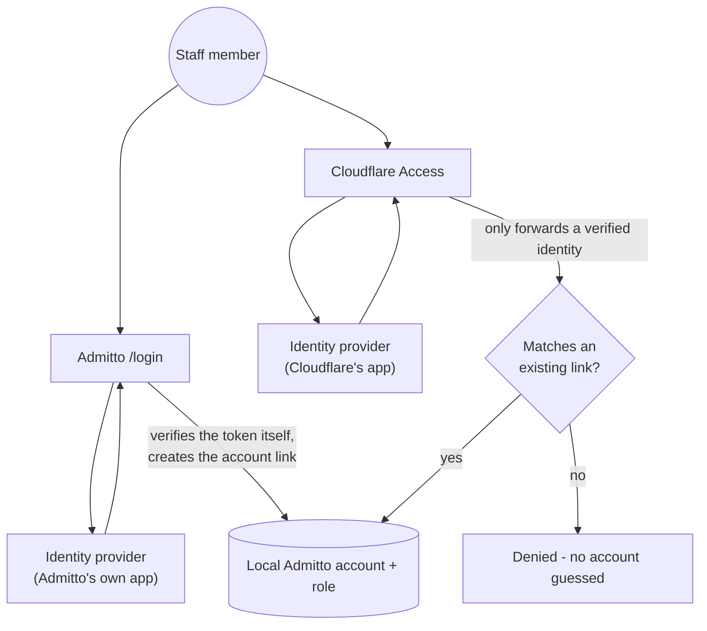

# Cloudflare Access - Identity Linking

**Audience:** Superadmins · **Required role:** Superadmin · **Feature status:** ✅ Available · **Last verified:** Admitto 0.5.2

## What this page helps you do

Bind Cloudflare Access sign-ins to an existing, already-linked Admitto account, so a staff member who has signed in through your direct OIDC provider (for example Authentik, Okta, Microsoft Entra ID, or OneLogin) once can pass through Cloudflare Access and land in the admin panel without a second Admitto sign-in screen. This page covers the identity-linking layer specifically. Set up the base Cloudflare Access connection first from [Identity and SSO](Identity-and-SSO).

## Why two separate sign-ins

Cloudflare Access and Admitto's own direct sign-in both end up talking to your identity provider, but they answer two different questions, and neither replaces the other:



- **Cloudflare Access decides whether a request reaches Admitto at all.** It is a perimeter control, closer to a guard checking ID at a building's front door than to Admitto's own sign-in. It has no concept of Admitto's user accounts or roles - it only knows "the identity provider verified this person," using its own registered application there, separate from Admitto's.
- **Admitto's own direct sign-in decides who that person is inside Admitto, and what they can do.** That only ever comes from an account that has already signed in through the direct provider itself - the one thing that actually teaches Admitto "this identity is this specific local account with this specific role." Cloudflare passing someone through never creates or implies that link on its own.
- Disabling Cloudflare Access does not disable sign-in: staff can still reach `/login` and sign in through the direct provider, entirely bypassing Cloudflare. The reverse also holds - if Cloudflare Access itself has an outage while the identity provider is healthy, staff are not locked out as long as `/login` stays reachable outside Cloudflare's protected paths (see Important decisions below), since the direct sign-in talks to the identity provider on its own, independent of Cloudflare.
- Your identity provider's own event log may not show a clearly labelled "Admitto" entry for a Cloudflare Access sign-in - from its side, that sign-in only ever authorized the generic Cloudflare application, not Admitto specifically. The direct sign-in is the one it logs against an application actually named for Admitto.

## Before you start

- Complete both the direct OIDC provider setup and the base Cloudflare Access connection (team URL, audience tag, protected paths) described in [Identity and SSO](Identity-and-SSO) first.
- Keep a way back into Admitto that does not depend on Cloudflare before changing anything here - a break-glass local password session, or network access to the origin that bypasses Cloudflare.
- Confirm exactly which application at your identity provider Cloudflare authenticates against. If more than one application could plausibly be it (for example a separate account-provisioning integration sitting alongside the sign-in one), match it by its **Client ID** in Cloudflare's identity provider settings rather than guessing from a similar-looking name.

> [!CAUTION]
> A wrong claim name or a mismatched identifier silently blocks every sign-in through Cloudflare, including your own, with no fallback on the same path once Cloudflare is already enforcing on it. Verify each change in Cloudflare's own identity provider Test result before touching a real sign-in.

## Steps

1. At your identity provider, add a custom claim (sometimes called a scope mapping, attribute mapping, or claim mapping, depending on the provider) that returns a stable identifier for the signed-in user, for example `admitto_identity`. In Authentik, this is **Customization → Property Mappings → Create**, an OAuth2/OpenID Provider Scope Mapping, with a Python expression such as:

   ```python
   return {"admitto_identity": request.user.uid}
   ```

   Okta, Microsoft Entra ID, and OneLogin each have an equivalent mechanism under their own name (for example custom authorization server claims, optional claims, or app parameters) - check your provider's own documentation for the exact steps. Whichever provider you use, attach the claim to a scope Cloudflare already requests by default, such as `profile`, rather than inventing a new scope name of your own - Cloudflare only receives claims tied to scopes it actually asks for.
2. Attach the new claim to the specific application your identity provider uses for Cloudflare (matched by Client ID, see Before you start) - creating the claim in step 1 does not attach it to anything by itself in most providers, including Authentik.
3. Confirm that application produces the exact same identifier for a given person as the application Admitto's direct sign-in already uses. Many providers can compute a different, per-application identifier by default (sometimes described as pairwise or hashed) rather than one stable value shared across every application - if yours does, set both applications to the same, non-hashed mode (Authentik calls this setting **Subject mode**). Do not change this setting on the application Admitto's direct sign-in already uses if any account has signed in through it - that orphans its existing links.
4. If the direct provider has group-to-role mappings configured, repeat steps 1-3 for a second, bounded claim carrying only the groups Admitto's mappings actually use (for example `admitto_groups`) - do not forward an entire directory-wide group list.
5. In Cloudflare Zero Trust, open **Integrations → Identity providers**, edit your identity provider entry, and add your claim name(s) from steps 1 and 4 under **OIDC Claims**. This is a different field from **OIDC Scopes** further down the same page: Scopes controls what Cloudflare requests, Claims controls what Cloudflare actually copies into the signed Access JWT it sends to Admitto. Adding a claim name only under Scopes forwards nothing.
6. Click **Test** on that same Cloudflare identity provider page and confirm your claim name (for example `admitto_identity`) appears under `oidc_fields` with a real value, before testing an actual sign-in.
7. Select this direct provider as **Direct identity provider** in Admitto's Cloudflare Access settings (see [Identity and SSO](Identity-and-SSO)) if you have not already, and confirm the account you will test with has signed in through the direct provider at least once - that sign-in is what actually creates the link Cloudflare's assertion will match against.
8. Sign in through the Cloudflare-protected URL in a private/incognito window. You should land directly in the admin panel with no second Admitto sign-in screen.

## Expected result

A staff member already linked to the selected direct provider signs in through Cloudflare Access and enters the admin panel directly. Anyone Cloudflare authenticates who has never signed in through that direct provider is denied, with no account created and no link guessed from their e-mail address.

## Important decisions

- Cloudflare Access only decides whether a request reaches Admitto at all - it never decides which local account or role a person gets. That always comes from an existing, explicit link to the selected direct provider, created the normal way by a real sign-in through that provider. There is no automatic account creation and no linking by e-mail on this path.
- This automatic sign-in applies to `/admin`, `/api/admin/*`, and the check-in scan/lookup API - not to Admitto's own `/login` page, which is unrelated to Cloudflare Access and always shows the password form whether or not Cloudflare also protects that path. Which paths Cloudflare gates at the edge is a separate choice made in the Cloudflare Access application, independent of anything configured in Admitto.
- Admitto's own **Protected URL paths** field (Organisation settings → Identity → Cloudflare Access, see [Identity and SSO](Identity-and-SSO)) only drives Admitto-side decisions, such as the check-in redirect fallback described below - it never configures Cloudflare itself. If your Cloudflare Access application was created before check-in accepted this identity, or its path match otherwise still only lists `/admin` and `/api/admin/*`, add `/api/checkin` to that application directly. Until you do, Cloudflare never forwards a token on check-in requests and scanning falls back to requiring an ordinary Admitto session, even though `/admin` itself works through Cloudflare.
- Protecting `/login` with Cloudflare too stops anyone reaching the password form without first clearing Cloudflare, but removes it as a recovery path if Cloudflare or the identity provider ever has an outage. Decide this deliberately rather than by default.
- Role grants for a Cloudflare sign-in come only from the group claim configured in steps 4-5, never from any group data Cloudflare provides natively.
- A staff account that signs in **without** going through Cloudflare Access (local password, or directly through your identity provider) gets a normal Admitto session, not a Cloudflare Access identity. If that account's usual landing page is `/admin` and Cloudflare protects that path, the sign-in and any two-factor step still complete normally, but the session cannot reach `/admin` itself - only a Cloudflare Access identity can. Admitto detects this and lands the account on the check-in surface (`/operator`) instead, since that page is not behind Cloudflare and every admin and superadmin can already use it. This is expected, not a failed sign-in.

## What changes after this action

Staff already linked to the selected direct provider skip Admitto's own sign-in screen when arriving through Cloudflare Access. Nobody else gains access through this path. Local-password and direct-OIDC sign-in still work exactly as before for every account whose landing page isn't `/admin`; for one whose landing page is `/admin` and is now Cloudflare-protected, see the check-in redirect behaviour described above.

## Common problems

- **Sign-in through Cloudflare fails with "Forbidden" and no further detail:** open [Logs and Audit](Logs-and-Audit)'s System logs and look for `auth.cf_access` entries - every failed attempt logs a specific `reason`, listed below.
- **A local password or direct sign-in lands on the check-in screen instead of the admin panel:** expected once Cloudflare protects `/admin` - see Important decisions above. The sign-in itself succeeded; only a Cloudflare Access identity can reach `/admin`.
- **Signing in through Cloudflare Access reaches the admin panel fine, but live check-in scanning still asks for an Admitto session:** the Cloudflare Access application's own path match likely doesn't include `/api/checkin` yet - add it there. Admitto's own Protected URL paths setting alone has no effect on what Cloudflare forwards; see Important decisions above.
- **`missing_canonical_identity` or `invalid_canonical_identity`:** Cloudflare is not sending a usable claim at all - most often because it was added under OIDC Scopes instead of OIDC Claims (step 5), or because the value looks like an e-mail address, which is rejected on purpose. Re-check step 5 and Cloudflare's own Test result.
- **`source_identity_not_linked`:** the value Cloudflare sent does not match any existing link to the direct provider. Either the account has never signed in through that direct provider yet (step 7), or the two applications at your identity provider are computing different identifiers for the same person (step 3).
- **`source_provider_not_configured` or `source_provider_unavailable`:** no Direct identity provider is selected in Admitto's Cloudflare Access settings, or the one selected is currently disabled.
- **`source_groups_unavailable`:** the direct provider has group-to-role mappings configured, but this particular sign-in did not carry a usable group claim. Add or fix the group claim the same way as the identity claim (steps 4-5).
- **`source_user_inactive`:** the linked local account is deactivated.
- **`cloudflare_subject_already_linked`:** this Cloudflare identity is already bound to a different local account than the one the claim points to.
- **Everything above looks correct but sign-in still fails the same way:** the browser may still be using a Cloudflare Access session issued before the fix. Sign out of Cloudflare Access itself, not just Admitto, or test from a private window that has never used this Access application before.

## Related pages

- [Identity and SSO](Identity-and-SSO) - base OIDC and Cloudflare Access setup
- [Logs and Audit](Logs-and-Audit) - where to read `auth.cf_access` reason codes
- [Organisation Settings](Organisation-Settings)
