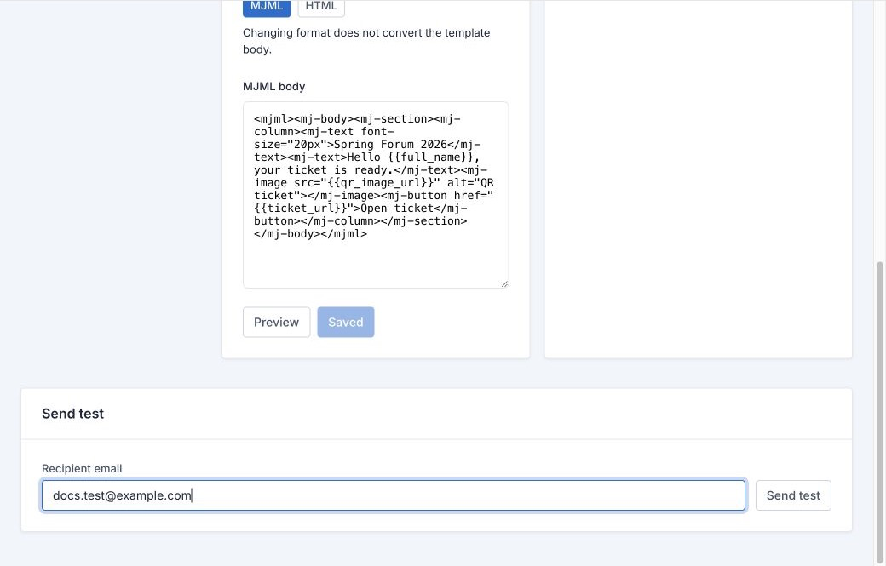

# Email Templates

> **Audience:** Event Manager
> **Required role:** Organisation Admin
> **Feature status:** Available
> **Last verified:** Admitto 0.4.12

Use **Communication** to prepare the message that attendees receive with their ticket.

## Prepare a message

1. Open the event and select **Communication**.
2. Select the template you want to work on.
3. Write a clear subject and message.
4. Use the available placeholders only where their value makes sense to an attendee.
5. Review the preview before saving.

Keep the message short. Tell attendees what the event is, when and where it happens, and what they need to bring or show at entry.

## Send a test

1. Save the template.
2. Enter an approved test address.
3. Select **Send test**.
4. Read the delivered message on a normal email client.
5. Check the subject, event details, links, images, and ticket information.

Fix the template and repeat the test when anything is unclear or missing. A successful test is not the same as sending tickets; use [Sending Tickets and Delivery](Sending-Tickets-and-Delivery) when the message is ready.

## Manage templates safely

Keep the default ticket template available for ticket delivery. Use a clearly named additional template only when your event needs a different approved message. Do not put sensitive attendee information into a subject line or template text.
