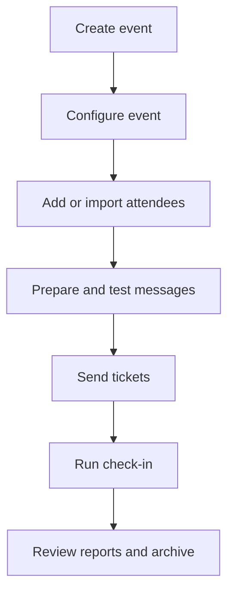

# Admitto Documentation

**Audience:** All staff · **Required role:** Any staff role · **Feature status:** ✅ Available · **Last verified:** Admitto 0.5.1

Admitto helps event teams prepare attendee lists, send tickets, and run check-in.

## Find your starting point

| I want to… | Start here |
|---|---|
| Organise an event | [First Event Checklist](First-Event-Checklist) |
| Prepare attendee data | [Importing Attendees](Importing-Attendees) and the [Import File Reference](Import-File-Reference) |
| Create event messages | [Email Templates](Email-Templates) and [Sending Messages and Delivery](Sending-Tickets-and-Delivery) |
| Push a wallet notification | [Sending Wallet Messages](Sending-Wallet-Messages) |
| Admit attendees at the entrance | [Operator Quick Start](Operator-Quick-Start) |
| Administer an organisation's events | [Organisation Administration](Organisation-Administration) |
| Manage the Admitto instance | [Superadmin Quick Start](Superadmin-Quick-Start) |

## The event journey

The diagram is a quick overview. The numbered list below describes the same journey in text.

1. Create the event and check its basic details.
2. Add ticket types and event requirements when needed.
3. Add or import attendees.
4. Prepare a message, send a test, then send tickets.
5. Prepare devices and staff for check-in.
6. Review attendance and archive the event when work is complete.

Use the [Reference Hub](Reference-and-Troubleshooting) for file columns, template variables, delivery statuses, and product terms. Use [Help and Troubleshooting](Help-and-Troubleshooting) when a task does not produce the expected result.

## What this Wiki covers

This Wiki explains supported day-to-day use of Admitto. It does not contain deployment instructions, security architecture, private operating procedures, or privacy case handling. For those topics, start with [Technical Documentation](Technical-Documentation).
