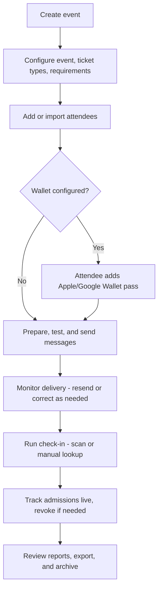

# Admitto Documentation

**Audience:** All staff · **Required role:** Any staff role · **Feature status:** ✅ Available · **Last verified:** Admitto 0.5.1

Admitto helps event teams prepare attendee lists, send tickets, and run check-in.

## Find your starting point

| I want to… | Start here |
|---|---|
| Organise an event | [First Event Checklist](First-Event-Checklist) |
| Prepare attendee data | [Importing Attendees](Importing-Attendees) and the [Import File Reference](Import-File-Reference) |
| Create event messages | [Email Templates](Email-Templates) and [Sending Messages and Delivery](Sending-Tickets-and-Delivery) |
| Push a wallet notification | [Sending Wallet Messages](Sending-Wallet-Messages) |
| Admit attendees at the entrance | [Operator Quick Start](Operator-Quick-Start) |
| Administer an organisation's events | [Organisation Administration](Organisation-Administration) |
| Manage the Admitto instance | [Superadmin Quick Start](Superadmin-Quick-Start) |

## The event journey

The diagram is a quick overview. The numbered list below describes the same journey in text, and who normally does each step - see [Roles and Permissions](Roles-and-Permissions) for exactly what each role can and cannot do.

1. **Create the event and check its basic details** (name, date, timezone, venue). *Administrator or Superadmin.*
2. **Configure ticket types, requirements, and (optionally) Wallet.** Wallet setup itself is Superadmin-only; everything else here is Administrator or Superadmin.
3. **Add or import attendees** - one at a time, or from a CSV/XLSX file. *Administrator or Superadmin.*
4. **Prepare a message, send a test, then send tickets.** If Wallet is configured, the attendee can add their pass straight from the ticket page - no separate step for staff to trigger. *Administrator or Superadmin sends; the attendee receives and, optionally, adds the pass.*
5. **Monitor delivery and correct problems** - resend a bounced or failed message, correct a typo, revoke or reissue a ticket if needed. *Administrator or Superadmin.*
6. **Run check-in on event day.** An Operator scans tickets (or looks an attendee up by name, if manual lookup is allowed for that event) at the door; an Administrator or Superadmin can watch admissions update live from the Overview page without being at the door themselves.
7. **Review attendance, export reports, and archive the event** once it's over. *Administrator or Superadmin.*

Attendees never sign in to Admitto. They receive a ticket by email, present it (as a QR code, a wallet pass, or their name at manual lookup) at the door, and that's their entire interaction with the system.

Use the [Reference Hub](Reference-and-Troubleshooting) for file columns, template variables, delivery statuses, and product terms. Use [Help and Troubleshooting](Help-and-Troubleshooting) when a task does not produce the expected result.

## What this Wiki covers

This Wiki explains supported day-to-day use of Admitto. It does not contain deployment instructions, security architecture, private operating procedures, or privacy case handling. For those topics, start with [Technical Documentation](Technical-Documentation).
