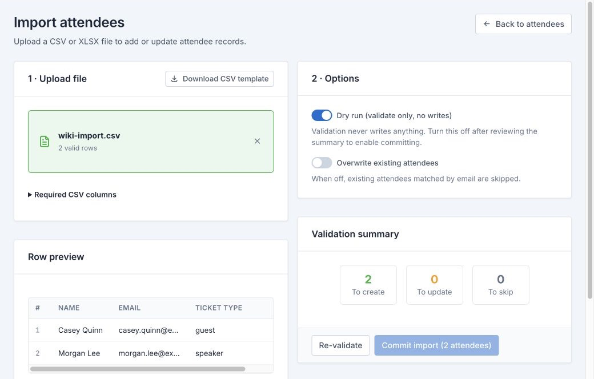

# Importing Attendees

> **Audience:** Event Managers
> **Required role:** Organisation Admin
> **Feature status:** Available
> **Last verified:** Admitto 0.4.12

## What this page helps you do

Validate and import many attendees from CSV or XLSX while controlling duplicates and updates.

## Before you start

- Download the current CSV template from **Import attendees**.
- Configure ticket types and custom attendee fields before preparing their columns.
- Read [Import File Reference](Import-File-Reference) for every supported column.
- Remove practice data and confirm that the source file is approved for this event.

## Steps

1. Open the event, then **Attendees**.
2. Select **More**, then **Import**.
3. Upload a CSV or XLSX file.
4. Keep **Dry run (validate only, no writes)** enabled and select **Validate file**.
5. Review valid, invalid, warning, skipped, create, and update counts plus the sample rows.
6. If needed, change **Overwrite existing attendees**, then select **Re-validate**.
7. Correct the source file and validate again until the summary is understood.
8. Turn off **Dry run** only when you intend to write the displayed changes.
9. Select **Commit**. Admitto queues the import for the background worker and shows progress until it finishes. Keep the worker running (`npm run worker` locally, or compose `worker` in deploy). When it finishes, review the final result and import history.

## Expected result

New attendees are created, permitted fields on matched attendees are updated when overwrite is on, and every skipped or invalid row has a displayed reason.

## Important decisions

- Use `first_name` plus `last_name`, or use the single `name` column. `email` is always required.
- External UUID and QR values are optional and should be used only when an external ticket source already owns them.
- Matching uses agency identifiers first when present, then email. Conflicting identifiers are skipped.
- With overwrite off, matching attendees are skipped.
- With overwrite on, Admitto can update name, ticket type, company, department, and supplied custom fields. It never overwrites pass status, QR payload, external UUID, or the secure ticket token.

## What changes after this action

A committed import changes the attendee list and records an import-history entry. Validation alone writes nothing.

## Common problems

- **Invalid row:** correct the displayed data error in the source file.
- **Warning:** review it; unknown columns are ignored and duplicate headers use the last value.
- **Skipped attendee:** read the reason, then decide whether overwrite is appropriate.
- **Unknown ticket type:** use a configured label or key and validate again.
- **Event is at capacity:** an Organisation Admin can open **Event settings** and review capacity. A Superadmin-only override is offered only when an authorised exception is required.

## Related pages

- [Import File Reference](Import-File-Reference)
- [Managing Attendees](Managing-Attendees)
- [Ticket Types](Ticket-Types)
- [Custom Attendee Fields](Custom-Attendee-Fields)
