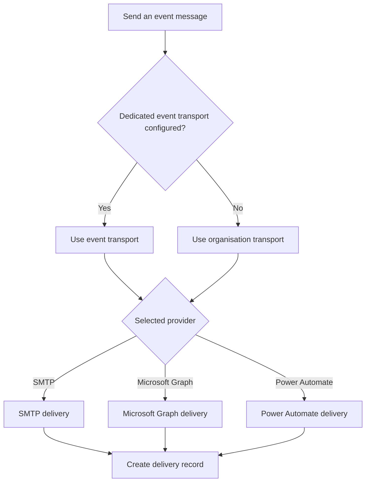

# Mail Delivery Administration

> **Audience:** Superadmins
> **Required role:** Superadmin for organisation transport; Superadmin for event Mailing settings
> **Feature status:** Available
> **Last verified:** Admitto 0.4.12

## What this page helps you do

Select, test, and troubleshoot the supported mail transport used by event messages, and optionally configure per-event bounce detection from forwarded delivery-failure mail.

## Before you start

Obtain approved provider details through your organisation's secure process. Do not paste secrets into issues, screenshots, or this Wiki.

## How Admitto chooses a transport

An event uses its dedicated transport only when one is configured. Otherwise, it uses the organisation transport. Every send creates a delivery record.

| Transport | Connection model | Important configuration |
|---|---|---|
| SMTP | Direct mail server connection | Host, port, credentials, and sender |
| Microsoft Graph | Microsoft 365 application-only sending | Application credentials and mailbox |
| Power Automate | Webhook-based delivery | Flow URL and secret key |

## Bounce detection (delivery failures)

Admitto can read a mailbox for forwarded delivery-failure emails (NDRs) and mark the matching send for **this event** as **Bounced**.

Sending tickets and reading bounces are separate steps. The bounce mailbox can be the **same account** you send from, or a **different inbox** if your send and receive setups differ.

### Before you start

- Superadmin access.
- An IMAP mailbox Admitto can reach (host, port 993 / TLS, username, password).
- Ability to set a return address with a sub-address on the sending mailbox (e.g. `you+admitto@example.com`) and an inbox rule that forwards matching delivery-failure messages to that IMAP mailbox.

### Steps

1. Open the event → **Event settings** → **Mailing**.
2. Scroll to **Bounce detection** (below Mail transport / Send test email).
3. Enter **IMAP host** and **Port** (default 993). These stay separate from SMTP because the IMAP hostname is often different even when the account is the same.
4. Either enable **Use SMTP username & password** (only when this event's effective mail transport is SMTP) or enter a dedicated IMAP username and password.
5. Adjust **Folders to check** if needed (default `INBOX, Junk Email`).
6. Turn the master switch **On**, Save, then **Test connection** (connection only; it does not process messages).
7. Complete the one-time mail-app setup described on the panel (sub-address + forward rule so failure replies land in that mailbox).
8. Optional: under **Send test email**, turn on **Also verify bounce**, enter an address that will hard-bounce (for example a nonexistent local part on a domain that returns NDR), and send. Admitto waits up to 90 seconds for a matching hard bounce to appear in the bounce mailbox. Like a plain Send test, this does not create an attendee or a delivery history row.

### Expected result

When a hard failure NDR is forwarded into the mailbox, the next ingest run updates the matching **real** attendee delivery to **Bounced**. Communication and Delivery details show the status; details include the SMTP code and a short plain-English explanation. **Also verify bounce** confirms IMAP + parsing can see that kind of failure for the address you entered, without creating a guest record.

### Important decisions

- Bounce settings are **per event** so the same recipient in two events does not create an ambiguous match.
- Soft / temporary SMTP failures (`4xx`) are logged and do not flip a successful send to Bounced.
- Messages are not deleted from the mailbox; Admitto records processed IMAP UIDs so accidental "mark as read" in a mail client does not skip a bounce.
- **Last automatic check** on the bounce panel shows the latest bounce-ingest run for this event (not Test connection). When more than one run exists, **Recent checks** lists the latest history. Organisation Settings → Health includes a soft Bounce detection row for enabled events.
- **Check every** sets how often bounce-ingest should poll this event's mailbox. The deploy process wakes on a short tick and skips events that are not yet due. Soft Health uses both Check every and the deploy tick when deciding whether a successful run looks stale.
- Bounce-ingest can append run outcomes to **Organisation Settings → Logs** (System Logs, mail source) when the sidecar has `BOUNCE_INGEST_APP_URL` (or `ADMITTO_INTERNAL_URL`) and the same `OPS_HEALTH_TOKEN` as the app. Missing URL/token skips the bridge; it does not block mailbox polling.

### Common problems

- **Test connection failed:** check host/port/credentials and that the first configured folder exists on the server.
- **Status never becomes Bounced:** confirm the forward rule, that ingest is On, and that the NDR contains a supported diagnostic format (RFC 3464 delivery-status fields, or a recognized provider diagnostic line such as Postfix / mailhop / Synology).
- **No bounce lines in System Logs:** confirm the sidecar env has the app base URL and `OPS_HEALTH_TOKEN`, and that Settings → Logs is filtered to source **mail**.

## Steps

1. Open **Organisation settings**, then **Mail**.
2. Select the supported transport: **SMTP**, **Microsoft Graph**, or **Power Automate**.
3. Enter the fields required by the selected transport. Secret fields show only whether a value is configured.
4. Save the transport.
5. For SMTP, use **Test connection** on the SMTP connection card to verify host, port, and credentials without sending mail. Save first if the form has unsaved changes.
6. Send a transport test to an approved test address (**Send test email**).
7. For an event that must use a different transport, open **Event settings**, then **Mailing**, and choose a dedicated configuration. Dedicated SMTP also has **Test connection**.
8. Test the event transport before sending an event template.

## Expected result

**Test connection** reports that the SMTP account was verified (no message is sent). **Send test email** reports the selected provider and a successful send. Event templates then use the event transport when configured, otherwise the organisation transport.

## Important decisions

- SMTP is offered as the recommended general transport in the UI.
- **Test connection** (SMTP only) checks reachability and login; it does not send a message. **Send test email** delivers a real test message to the address you enter.
- Microsoft Graph uses application-only sending and a configured mailbox.
- Power Automate uses a configured webhook. Its URL and key are secrets.
- Returning an event to organisation settings removes its dedicated override.
- A successful transport test does not validate an event template; send a template test too.

## What changes after this action

Future test and attendee messages use the newly effective transport. Existing delivery records keep their recorded status and provider result.

## Common problems

- **Test failed:** recheck required fields and use the safe error shown by Admitto; do not publish raw provider responses.
- **The wrong sender is used:** verify organisation versus event scope and the provider's mailbox/from settings.
- **Event mail fails while the organisation test works:** inspect the event's dedicated override.

## Related pages

- [Email Templates](Email-Templates)
- [Email Delivery Statuses](Email-Delivery-Statuses)
- [Logs and Audit](Logs-and-Audit)
