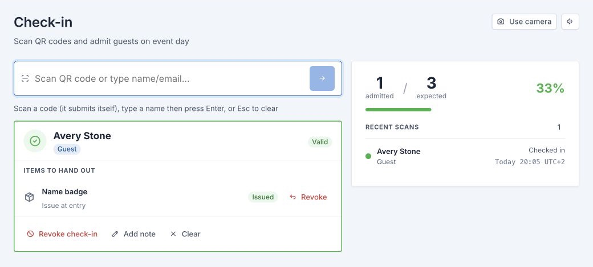

# Operator Quick Start

**Audience:** Check-in Operators · **Required role:** Operator for the event · **Feature status:** ✅ Available · **Last verified:** Admitto 0.4.13

## What this page helps you do

Prepare your device, scan an attendee ticket, and respond safely to the result shown by Admitto.

## Before you start

Sign in with your own account and open the assigned event. Confirm the event title and date with an Organisation Admin. Prepare the camera or scanner and scan one approved synthetic test ticket.

## Steps

1. Open **Check-in**.
2. Scan the attendee's QR code with the camera or connected scanner.
3. Check the attendee name and the result on screen.
4. If confirmation is enabled, confirm only after checking the attendee.
5. Issue each required item shown by Admitto.
6. Wait until the result is complete before scanning the next ticket.
7. Use **Undo check-in** only to reverse the latest valid admission made on that device.

Use manual lookup only when the event has enabled it and scanning is not possible.

## Expected result

A valid ticket is recorded as checked in once, and any required item actions are shown to the operator.

## Important decisions

- Follow the exact on-screen result; do not treat every visible attendee as valid for entry.
- Do not use another person's ticket or create a new attendee record at the entrance.
- Do not share accounts between operators.
- Stop before the next scan if the connection state is unclear.
- Ask an Organisation Admin to make administrative corrections.

## What changes after this action

A successful admission updates the attendee and event reports immediately when connected. A repeated scan returns an already-checked-in result instead of creating a second admission.

## Common problems

- **The camera does not scan:** check permission and lighting, or use the configured scanner.
- **The result is already checked in, revoked, or invalid:** pause and follow [Scanning Tickets and Results](Scanning-Tickets-and-Results).
- **Manual lookup is not available:** it has not been enabled for this event; ask an Organisation Admin.
- **The page shows Offline or Reconnecting:** stop scanning and follow [Check-in Connection Problems](Check-in-Connection-Problems).

## Related pages

- [Scanning Tickets and Results](Scanning-Tickets-and-Results)
- [Manual Lookup and Corrections](Manual-Lookup-and-Corrections)
- [Check-in Connection Problems](Check-in-Connection-Problems)
- [Roles and Permissions](Roles-and-Permissions)
